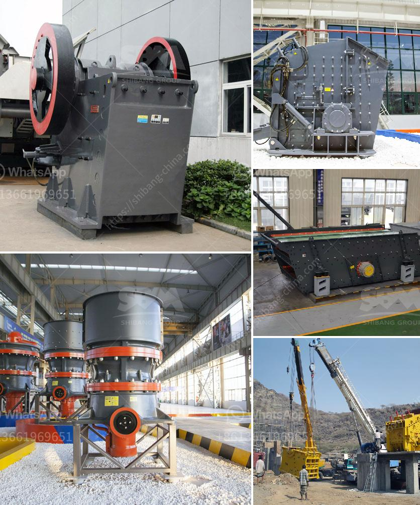

<h3>used steel ball mill</h3>
A steel ball mill is a type of grinder used to grind and blend materials for use in mineral dressing processes, paints, pyrotechnics, ceramics, and selective laser sintering. It works on the principle of impact and attrition: size reduction is done by impact as the grinding media (steel balls) drop from near the top of the mill.

The demand for steel ball mills has been steadily increasing due to their numerous advantages over traditional mills. However, purchasing a brand-new steel ball mill can be expensive, especially for small-to-medium-sized enterprises or those on a tight budget. This is where used steel ball mills come into play, offering a cost-effective solution without compromising on quality.

Used steel ball mills are an attractive option for several reasons. Firstly, they are significantly more affordable than new mills. The cost savings can be substantial, especially when considering the high prices of new equipment. By opting for a used steel ball mill, businesses can redirect the saved capital towards other important aspects of their operations.

Another advantage of used steel ball mills is their availability. Given their widespread usage in various industries, used mills are relatively easy to find. Many companies regularly upgrade their equipment, making quality used steel ball mills readily accessible in the market. This availability ensures that businesses can quickly find and acquire the equipment they need, reducing downtime associated with the procurement process.

Moreover, used steel ball mills have a proven track record. Their performance and reliability have already been tested in practical applications. Buying a used mill that has already demonstrated its capability offers a certain level of assurance that it will perform as expected. This eliminates the uncertainty associated with investing in new and untested equipment.

Furthermore, used steel ball mills are eco-friendly. By purchasing a used mill instead of a new one, businesses help reduce the demand for raw materials and energy required for manufacturing new equipment. This contributes to sustainability efforts and preserves valuable resources.

With that being said, when purchasing a used steel ball mill, it is essential to consider the mill's condition and maintenance history. Proper inspection and assessment of the equipment are crucial to ensure its reliability and longevity. It is advisable to work with reputable sellers who provide detailed information about the mill's specifications, operational history, and any necessary repairs or maintenance that has been performed.

In conclusion, used steel ball mills offer a cost-effective solution for businesses looking to acquire grinding equipment without breaking the bank. Their affordability, availability, proven performance, and eco-friendly benefits make them an attractive option for various industries. However, it is crucial to conduct a thorough inspection and assessment before committing to a purchase. By investing in used equipment wisely, businesses can reap the benefits of efficient ore grinding while saving money and contributing to sustainability efforts.
<h3>Contact us</h3><ul><li><strong>Whatsapp:&nbsp;<a href="https://wa.me/8613661969651">+8613661969651</a></strong></li><li><a href="https://swt.shibang-china.com/?git&amp;zhl&amp;used steel ball mill"><strong>Online Service(chat now)</strong></a></li></ul><h3>Related</h3><ul><li><a href='how to start a sand mining business in south africa.md'>how to start a sand mining business in south africa</a></li><li><a href='stone crusher dubai.md'>stone crusher dubai</a></li><li><a href='small quartz appratus for crushing.md'>small quartz appratus for crushing</a></li><li><a href='stone crusher mini.md'>stone crusher mini</a></li><li><a href='stone crusher in mexico.md'>stone crusher in mexico</a></li></ul>