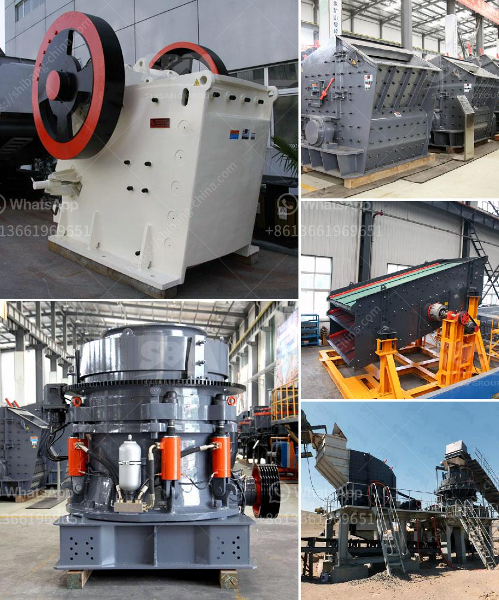

<h3>used stone crusher for sale europe</h3>
In today's fast-paced environment, everyone is well aware of the constant need for construction materials and aggregate. Landscapers, homeowners, builders, and contractors all require high-quality materials to complete their projects effectively. One essential resource for acquiring such materials is a stone crusher.

A stone crusher is a machine used to crush rocks into smaller-sized pieces. These machines usually feature a large, rotating drum that crushes the stones into smaller fragments. Within this machine, there are two jaws - one fixed and the other moving. The moving jaw applies pressure on the stones, thus crushing them into smaller sizes.

The European market is always seeking cost-effective and efficient solutions for construction purposes. Hence, used stone crushers have become an ideal option for various industries and construction projects. To ensure their function and durability, these machines undergo thorough inspection and maintenance before being put up for sale.

When it comes to used stone crushers in Europe, the choice often depends on several factors. Some of the factors being the manufacturer, location, condition, and price of the machinery. Here, we will explore some popular models available for purchase.

One commonly used stone crusher machine in Europe is the BF90.3, which is made by the renowned manufacturer MB Crusher. This machine offers impressive crushing power and has a jaw capacity of 90x45 cm. It is well-suited for use on demolition sites as well as for crushing rocks in quarries.

Another commonly used stone crusher in Europe is the FAE MTH series. This machine is specifically designed for demanding conditions, producing consistent and high-quality output. The FAE MTH series can crush stones up to a maximum diameter of 50 cm and is equipped with a variable transmission for precise crushing.

One popular used stone crusher in Europe is the Seppi Maxisoil. This machine is capable of crushing stones up to 50 cm in diameter and features a highly efficient motor that provides excellent crushing power. The Seppi Maxisoil is widely used in a variety of applications, such as road construction and agricultural works.

When considering the purchase of a used stone crusher, it is crucial to ensure that the machine's maintenance records are available. These records provide valuable insight into the machine's history, ensuring its reliability and longevity.

Additionally, it is essential to thoroughly inspect the machine before finalizing the purchase. Checking for signs of wear and tear and ensuring that all components are in good working order will help avoid any future complications.

In conclusion, the used stone crusher market in Europe offers various options for customers looking for cost-effective and efficient machinery. These machines play a crucial role in the construction industry, enabling the production of high-quality materials needed for various projects. By considering factors such as the manufacturer, location, condition, and maintenance records, individuals can acquire reliable and durable used stone crushers to meet their specific requirements.
<h3>Contact us</h3><ul><li><strong>Whatsapp:&nbsp;<a href="https://wa.me/8613661969651">+8613661969651</a></strong></li><li><a href="https://swt.shibang-china.com/?git&amp;zhl&amp;used stone crusher for sale europe"><strong>Online Service(chat now)</strong></a></li></ul><h3>Related</h3><ul><li><a href='second hand gypsum powder line.md'>second hand gypsum powder line</a></li><li><a href='calcium carbonate grinding mill price.md'>calcium carbonate grinding mill price</a></li><li><a href='marble production process.md'>marble production process</a></li><li><a href='jual jaw crusher kenya.md'>jual jaw crusher kenya</a></li><li><a href='ball mill feldspar 200 mesh output.md'>ball mill feldspar 200 mesh output</a></li></ul>