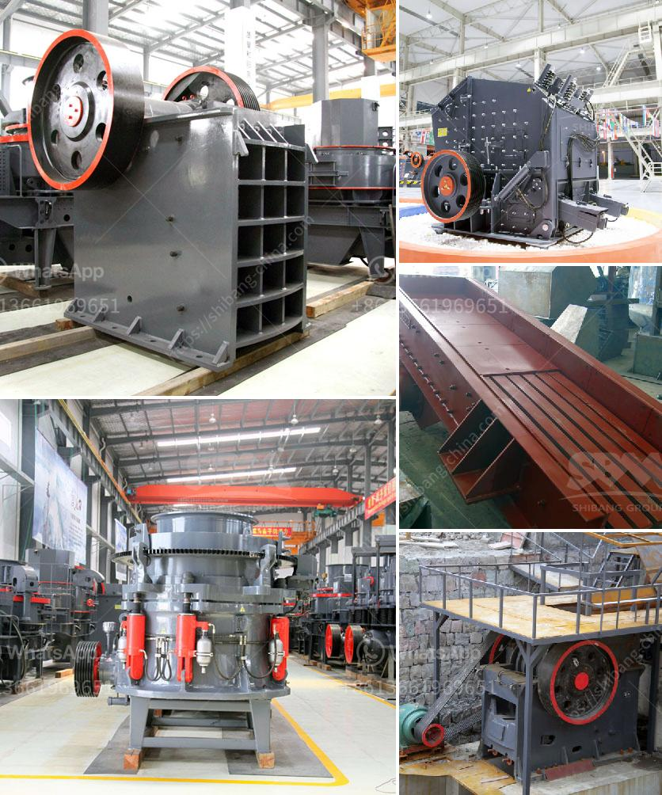

<h3>used stone crusher for sale in florida</h3>
When it comes to a wide variety of heavy equipment including crushers, screens, conveyors, and washers, it is vital to ensure that a reliable and efficient stone crushing unit is available for rent or purchase. At A.M. King, a used stone crusher for sale can be obtained at an affordable price range that will be perfect for your budget needs.

By purchasing a used stone crusher, you are able to save and invest more money while utilizing the available resources to be productive and efficient. These crushing units enable construction companies as well as mining and quarrying operations to easily transport and process stones into a useful material for various applications.

One of the most important aspects to consider when purchasing a used stone crusher is the durability and longevity of the machine. You will want to ensure that it is capable of withstanding heavy loads and harsh environments without any significant wear or tear.

In Florida, where the climate can often be hot and humid, it is crucial to choose a stone crusher that can tolerate these conditions. Additionally, factors such as size and capacity should be considered based on the specific requirements of your project.

A used stone crusher for sale in Florida will help you save costs while achieving the desired level of productivity. When purchasing a used machine, it is important to consider factors such as its condition, especially if you will be using it in a challenging environment.

Fortunately, at A.M. King, all used stone crushers are thoroughly inspected and evaluated to ensure they are in optimal condition. With a reliable inspection process in place, you can feel confident that your purchase will meet your desired specifications and deliver the expected performance.

Florida offers various opportunities for construction and mining companies, making it an ideal location to acquire a used stone crusher. With many construction projects taking place across the state, having a reliable crushing unit can help expedite these projects, saving both time and effort.

Furthermore, the resale value of a used stone crusher remains significant, making it a good investment. Should you decide to upgrade or replace it in the future, you can easily find buyers who are willing to purchase a reliable, well-maintained machine.

To assist you with your specific requirements, A.M. King offers a wide range of crushing equipment, including jaw crushers, cone crushers, impact crushers, and rotary crushers. These machines are designed to provide reliable performance and optimal productivity.

In conclusion, a used stone crusher for sale in Florida provides an efficient, cost-effective solution for all your crushing needs. Whether you are a construction company or a mining operation, using this equipment will help you get the job done efficiently and effectively.

By investing in a used stone crusher, you can capitalize on its durability, avoid costly repairs, and ensure that your projects run smoothly. Whether you need a portable or stationary unit, A.M. King has a selection of used stone crushers in Florida that will meet your specific needs and budget, allowing you to achieve maximum productivity.
<h3>Contact us</h3><ul><li><strong>Whatsapp:&nbsp;<a href="https://wa.me/8613661969651">+8613661969651</a></strong></li><li><a href="https://swt.shibang-china.com/?git&amp;zhl&amp;used stone crusher for sale in florida"><strong>Online Service(chat now)</strong></a></li></ul><h3>Related</h3><ul><li><a href='mini cement plant project in india.md'>mini cement plant project in india</a></li><li><a href='gypsum mining plant.md'>gypsum mining plant</a></li><li><a href='jaw crusher price suppliers.md'>jaw crusher price suppliers</a></li><li><a href='cost setting up limestone mine.md'>cost setting up limestone mine</a></li><li><a href='used mining equipment for sale in ghana.md'>used mining equipment for sale in ghana</a></li></ul>