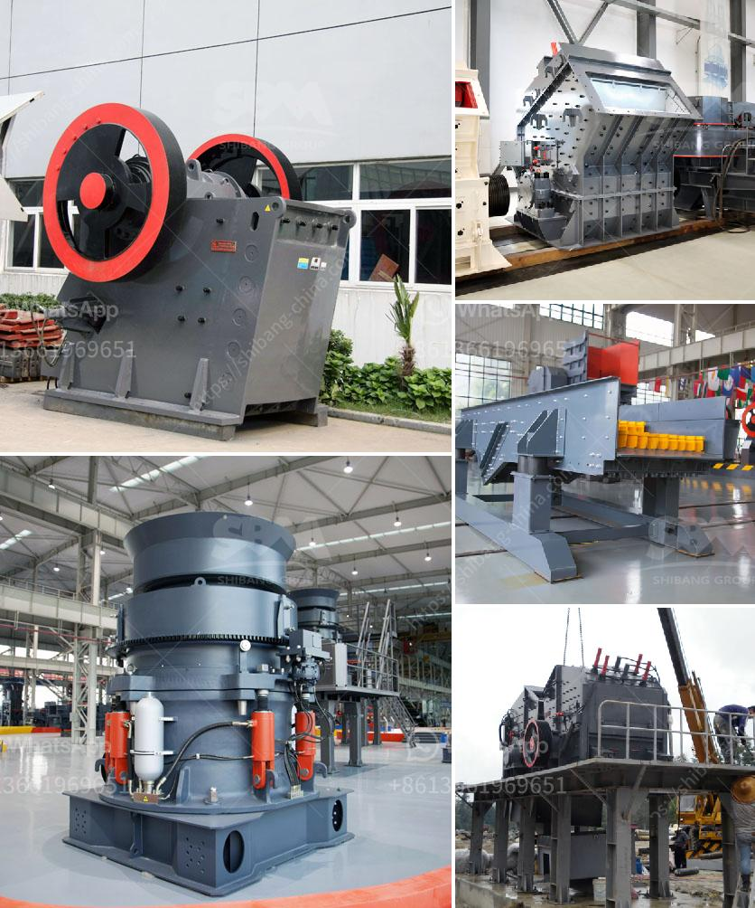

<h3>used stone crusher in usa for sale</h3>
The United States is one of the most developed nations in the world, with a population of over 5 million people. It is also a significant consumer of natural resources, including various types of stones. As a result, the demand for stone crushers has been continually rising in the country.

A stone crusher is a machine used to crush rocks into smaller pieces, usually for gravel or some other road or building application. Most stone crushers have a hopper at the top, a container which holds the rock above the crusher and uses gravity to feed it in. As the rock falls into the rotor of the crusher, it is subjected to high-speed impact with the blow bars that are fixed on the rotor. This allows the material to be crushed and reduces it to the desired size.

The market for used stone crushers is booming, and there is no shortage of used machines on the market. The prices of these machines are much lower compared to new ones, and this makes them more appealing to investors and buyers. When deciding to purchase a used stone crusher, it is also important to consider the durability and reliability of the machine. You want a crusher that can withstand the rigorous demands of daily use without breaking down.

One of the advantages of buying used stone crushers is that they are generally in better condition compared to new ones. Many sellers and auctioneers offer inspection reports on used equipment, allowing buyers to assess the condition and performance of the crusher before making a purchase. Additionally, buying a used stone crusher helps to preserve the environment as it reduces the need for new stone crushers to be manufactured, thereby reducing carbon emissions.

In conclusion, used stone crushers offer numerous advantages over new ones in terms of price, durability, and environmental impact. With the increasing demand for stones, it is essential to invest in a high-quality stone crusher that can withstand daily use and deliver optimal performance. By opting for a used stone crusher, buyers can save money while contributing to a more sustainable future.
<h3>Contact us</h3><ul><li><strong>Whatsapp:&nbsp;<a href="https://wa.me/8613661969651">+8613661969651</a></strong></li><li><a href="https://swt.shibang-china.com/?git&amp;zhl&amp;used stone crusher in usa for sale"><strong>Online Service(chat now)</strong></a></li></ul><h3>Related</h3><ul><li><a href='vibrating screen manufacturers.md'>vibrating screen manufacturers</a></li><li><a href='company where they sell industrial mills.md'>company where they sell industrial mills</a></li><li><a href='used clay grinding machine for sale.md'>used clay grinding machine for sale</a></li><li><a href='machine to crush quartz into powder.md'>machine to crush quartz into powder</a></li><li><a href='jaw crusher south africa used.md'>jaw crusher south africa used</a></li></ul>