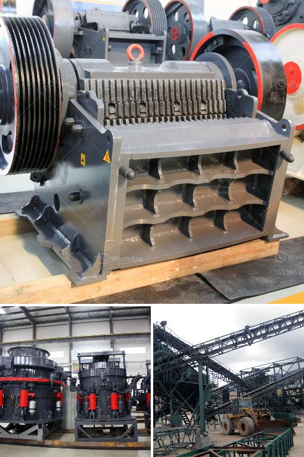

<h3>used stone crushers dealer</h3>
Used stone crushers are becoming more and more popular in the mining and construction industries. Not only are they cost-effective, but they also offer greater flexibility in terms of job sites and materials. With a wide range of models and types available on the market, finding a reliable and trustworthy used stone crushers dealer can be a daunting task. However, with careful research and consideration, you can find a dealer who will provide you with quality equipment that meets your needs.

Firstly, it is important to understand the specific requirements of your project. Different crushers are designed to handle different types of materials, such as rocks, gravel, or concrete. Consider the size, hardness, and density of the materials you will be processing and look for crushers that are suitable for those specific applications. This will help you narrow down your search for a dealer who specializes in the type of stone crushers you require.

Once you have a clear understanding of your needs, start researching used stone crushers dealers in your area. The internet can be a valuable tool in this process, as it allows you to quickly and easily access information about various dealers. Look for dealers with a strong online presence, as this typically indicates that they are established and reputable in the industry.

When evaluating potential dealers, pay attention to their experience and reputation. Dealers who have been in business for a long time are more likely to have a proven track record of providing high-quality equipment and excellent customer service. Look for testimonials or reviews from previous customers to get an idea of their satisfaction levels.

It is also important to consider the dealer's inventory and available options. Some dealers may specialize in specific brands or models, while others may offer a wider selection. Make sure the dealer you choose has a diverse inventory of used stone crushers, giving you the opportunity to compare different models and find the one that best fits your needs.

Price is another crucial factor to consider. While buying used equipment can save you money compared to purchasing new, it is still important to obtain competitive pricing. Compare prices from different dealers and negotiate to get the best deal possible. However, be wary of deals that seem too good to be true, as they may indicate hidden issues or poor quality equipment.

Finally, don't forget to inquire about after-sales service and support. Dealing with a dealer who offers maintenance, repairs, and spare parts can be highly beneficial in the long run. This ensures that you have access to the resources you need to keep your used stone crushers running smoothly and efficiently.

Finding a trusted used stone crushers dealer requires careful research and consideration. By understanding your specific needs, researching dealers, evaluating their experience and reputation, considering their inventory and pricing, and inquiring about after-sales support, you can make an informed decision and find a dealer who will provide you with reliable and high-quality equipment.
<h3>Contact us</h3><ul><li><strong>Whatsapp:&nbsp;<a href="https://wa.me/8613661969651">+8613661969651</a></strong></li><li><a href="https://swt.shibang-china.com/?git&amp;zhl&amp;used stone crushers dealer"><strong>Online Service(chat now)</strong></a></li></ul><h3>Related</h3><ul><li><a href='vibrating screen for sale philippines.md'>vibrating screen for sale philippines</a></li><li><a href='cost of crusher machine for grinding mica.md'>cost of crusher machine for grinding mica</a></li><li><a href='10 tpd grindig mill manufacturers philippines.md'>10 tpd grindig mill manufacturers philippines</a></li><li><a href='stone crusher plant for sale in pakistan.md'>stone crusher plant for sale in pakistan</a></li><li><a href='manganese ball milling machine.md'>manganese ball milling machine</a></li></ul>