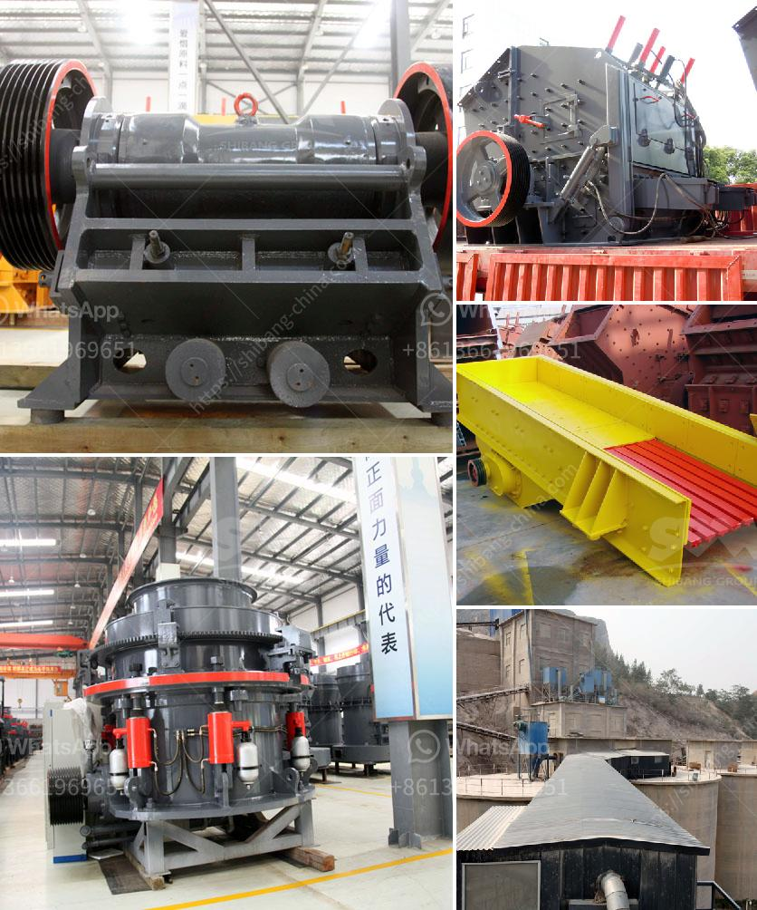

<h3>used vsi crusher for sale in india</h3>
Crusher is a key equipment in stone crushing industry. So if you are looking for a used VSI crusher for sale in India, you can contact us and we will provide you with the best quality products.

In today’s fast-paced world, everyone needs a place to live and to work. A growing population means the demand for housing and infrastructure is also increasing. This has led to a significant increase in the demand for stone crushers, which are used for breaking large stones into smaller pieces for various construction activities.

VSI (vertical shaft impact) crushers are one type of impact crushers, which offer higher reduction ratios at lower energy consumption. These crushers are known for their unique ability to provide cubical-shaped end products desired for the concrete and asphalt aggregates in road and railway projects.

Used VSI crushers for sale in India are part of our comprehensive range of products for the quarrying, mining, and recycling industries. These machines are known for their unique ability to process rocks at reduction ratios up to 16:1. With capacities ranging from 50 to 600 tph, we have the right crusher to meet your needs.

The used VSI crusher for sale in India offers many benefits compared to other crusher types. Firstly, the advanced crushing chamber design ensures the particles with a uniform shape. Secondly, the operational cost is low because of its wear-resistant parts and easy maintenance. Lastly, it is highly adaptable and flexible, allowing customers to adjust the crushing process according to their specific needs.

At present, we have a wide range of used VSI crushers for sale in India. These machines were previously used in world-class quarries and mines and are refurbished to their original condition. We offer a range of models from basic starter crushers to highly specialized machines. All our used crushers undergo a rigorous quality control process to ensure they are in excellent working condition.

In addition to the used VSI crushers, we also provide comprehensive after-sales service and support. Our experienced technical team is always ready to assist you in selecting the right crusher for your specific needs and to provide ongoing maintenance support. We understand that every customer has unique requirements, so we strive to provide personalized solutions to meet those needs.

In conclusion, a used VSI crusher for sale in India can provide the versatility and ease of maintenance that customers need. We offer excellent support and comprehensive service to ensure that customers get the most out of their equipment. With our extensive range of used crushers, high-quality products, and dedicated customer support, you can trust us as your go-to supplier for used VSI crushers in India.

So, if you are in the market for a used VSI crusher, contact us today and take your stone crushing business to new heights!
<h3>Contact us</h3><ul><li><strong>Whatsapp:&nbsp;<a href="https://wa.me/8613661969651">+8613661969651</a></strong></li><li><a href="https://swt.shibang-china.com/?git&amp;zhl&amp;used vsi crusher for sale in india"><strong>Online Service(chat now)</strong></a></li></ul><h3>Related</h3><ul><li><a href='granite quarry crusher equipment.md'>granite quarry crusher equipment</a></li><li><a href='used rock fine crusher for sale.md'>used rock fine crusher for sale</a></li><li><a href='twist of the ball mill.md'>twist of the ball mill</a></li><li><a href='ball mill machine india.md'>ball mill machine india</a></li><li><a href='vertically roller mill pakistan.md'>vertically roller mill pakistan</a></li></ul>