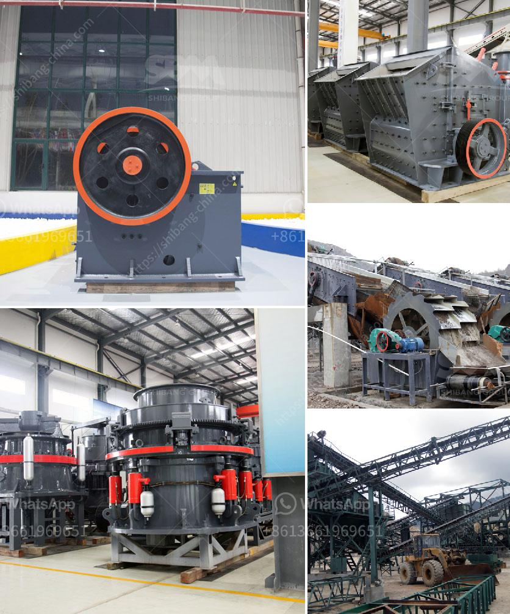

<h3>vertical ball mill with price</h3>
Vertical ball mill is a mill used for grinding materials into extremely fine powder. It is electrically operated and has a capacity ranging from 300 to 500 grams or less. This capacity makes it suitable for small-scale production or laboratory use.

Vertical ball mills are similar in appearance to traditional horizontal ball mills, but they differ in size, length, and the material being used. While traditional ball mills operate with a horizontal axis, vertical ball mills have a vertical axis of rotation.

The vertical axis allows for the efficient use of energy, as gravity assists in the continuous movement of the grinding media and material being ground. Additionally, the vertical design prevents the material from settling at the bottom of the mill, ensuring a homogeneous grind.

The vertical ball mill is commonly used for fine grinding of powders, such as paints, inks, pigments, ores, minerals, and chemicals. It is also suitable for grinding solids in suspensions, slurries, and pastes.

One of the key advantages of a vertical ball mill is its simple and compact design, making it easy to operate and maintain. Another advantage is its low noise level compared to other types of grinding mills, making it suitable for use in quiet environments such as laboratories.

When considering the price of a vertical ball mill, several factors need to be taken into account. The cost will depend on the model, capacity, and features of the mill. Additionally, the materials used in construction, such as stainless steel or ceramic, can impact the price.

On average, a vertical ball mill can range in price from $3,500 to $12,000. However, the cost largely depends on the quality, features, and capacity of the mill. Higher-end mills with greater capacity and advanced features can cost upwards of $20,000.

It is important to choose a vertical ball mill that suits your specific needs and budget. Consider factors such as the desired particle size, grinding media requirements, material compatibility, and required production capacity.

When purchasing a vertical ball mill, it is advisable to compare prices and features from different manufacturers and suppliers. Look for reputable companies that offer warranties and after-sales support to ensure the longevity and reliability of the equipment.

In conclusion, vertical ball mills are efficient and versatile mills used for fine grinding of powders and solids. They have a compact design, low noise level, and are easy to operate and maintain. The price of a vertical ball mill varies depending on the model, capacity, and features, with an average range of $3,500 to $12,000. By considering your specific requirements, you can find a vertical ball mill that meets your needs and budget.
<h3>Contact us</h3><ul><li><strong>Whatsapp:&nbsp;<a href="https://wa.me/8613661969651">+8613661969651</a></strong></li><li><a href="https://swt.shibang-china.com/?git&amp;zhl&amp;vertical ball mill with price"><strong>Online Service(chat now)</strong></a></li></ul><h3>Related</h3><ul><li><a href='cost of crusher machine for grinding mica.md'>cost of crusher machine for grinding mica</a></li><li><a href='basalt production equipment.md'>basalt production equipment</a></li><li><a href='limestone grinding raymond mill.md'>limestone grinding raymond mill</a></li><li><a href='mode of oeration of a gyratory crusher.md'>mode of oeration of a gyratory crusher</a></li><li><a href='differences with gyratory crusher cone crusher.md'>differences with gyratory crusher cone crusher</a></li></ul>