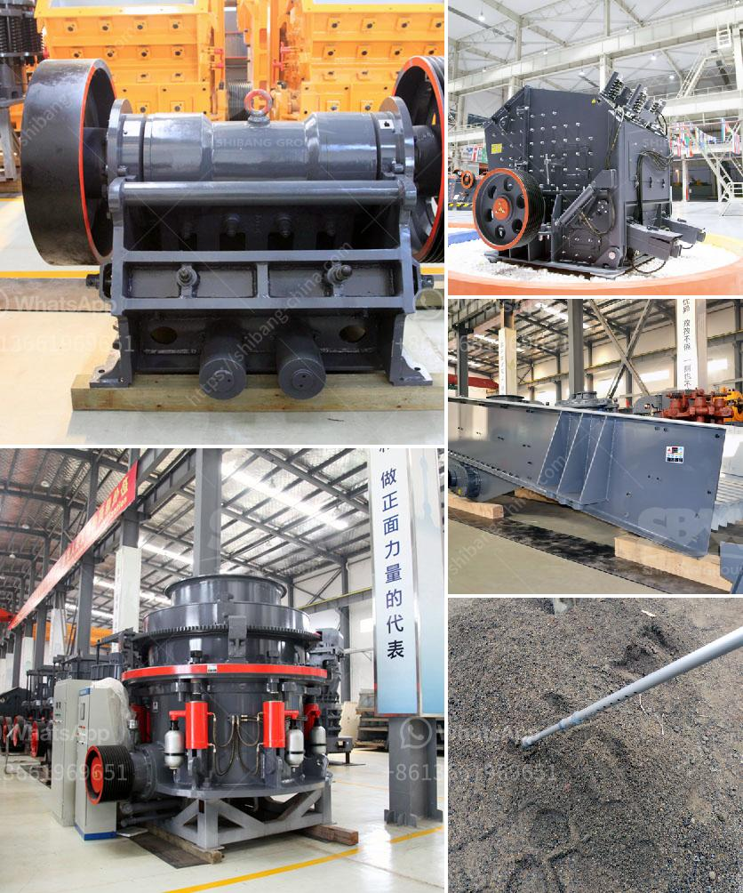

<h3>vertical grinding machine manufacturers</h3>
Vertical grinding machines are widely used in various industries such as automotive, aerospace, machinery manufacturing, and tooling. These machines offer high precision and efficiency in grinding operations, making them a preferred choice for manufacturers worldwide. In this article, we will explore some of the top vertical grinding machine manufacturers and their innovative offerings.

One of the leading manufacturers in this field is XYZ Machine Tools. The company provides a range of vertical grinding machines that offer high accuracy and reliability. These machines are designed for various applications, including cylindrical grinding, surface grinding, and tool grinding. XYZ Machine Tools is known for its solid construction and advanced features that ensure optimum performance and exceptional results.

Another prominent player in the market is Hardinge Inc., a global leader in the design and manufacture of precision grinding machines. Their vertical grinding machines are known for their versatility and efficiency. They are equipped with advanced technologies that enable operators to achieve tight tolerances and excellent surface finishes. Hardinge's vertical grinding machines are widely used in industries such as aerospace, automotive, and defense.

Kellenberger, a brand of Hardinge Inc., is also a renowned manufacturer of vertical grinding machines. Kellenberger machines are designed for precision grinding with exceptional rigidity and stability. The company offers a variety of models to cater to different customer requirements. Kellenberger machines are known for their user-friendly interface and high-performance capabilities.

Schaudt, a subsidiary of the United Grinding Group, is another top player in the vertical grinding machine market. The company offers versatile grinding machines that are suitable for both single-part and batch production. Schaudt's vertical grinding machines are characterized by their high precision, reliability, and ease of operation. They are widely used in industries such as automotive, energy, and tooling.

In conclusion, vertical grinding machines play a crucial role in various industries, and the manufacturers mentioned above are among the top players in the market. Their machines offer exceptional precision, efficiency, and performance, making them an ideal choice for manufacturers looking to enhance their grinding operations. Whether it's for cylindrical grinding, surface grinding, or tool grinding, these manufacturers provide innovative machines that meet the diverse needs of the industry.
<h3>Contact us</h3><ul><li><strong>Whatsapp:&nbsp;<a href="https://wa.me/8613661969651">+8613661969651</a></strong></li><li><a href="https://swt.shibang-china.com/?git&amp;zhl&amp;vertical grinding machine manufacturers"><strong>Online Service(chat now)</strong></a></li></ul><h3>Related</h3><ul><li><a href='sand and gravel wash plants usa.md'>sand and gravel wash plants usa</a></li><li><a href='wet process of cement manufacture.md'>wet process of cement manufacture</a></li><li><a href='iron ore beneficiation.md'>iron ore beneficiation</a></li><li><a href='sell jaw crusher the dubia.md'>sell jaw crusher the dubia</a></li><li><a href='vertically roller mill pakistan.md'>vertically roller mill pakistan</a></li></ul>