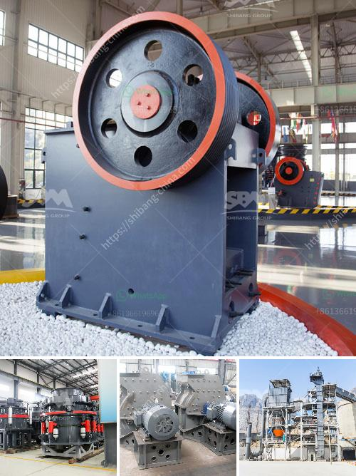

<h3>vertical mill ireland</h3>
Ireland, renowned for its picturesque landscapes and rich cultural heritage, is also making remarkable strides in the manufacturing industry. One particular innovation that has been gaining immense popularity in recent years is the vertical mill. A vertical mill is a cutting-edge piece of equipment that has revolutionized the manufacturing process by enhancing precision, efficiency, and productivity.

At its core, a vertical mill is a machine that uses a rotating tool to remove material from a workpiece, allowing manufacturers to shape it into the desired form. Unlike traditional milling machines that operate horizontally, vertical mills have a spindle that operates in a vertical orientation, allowing for greater flexibility and accuracy.

One of the primary advantages of a vertical mill is its exceptional precision. The vertical spindle allows for more accurate and intricate cuts, resulting in a higher level of detail and quality in the final product. This precision is particularly crucial in industries such as aerospace, automotive, and medical equipment manufacturing, where even the tiniest imperfections can have serious consequences.

Furthermore, vertical mills are incredibly efficient machines. The vertical orientation of the spindle allows for gravity to assist in the material removal process, reducing the need for excessive force. This not only increases the lifespan of the cutting tools but also minimizes the strain on the machine, resulting in fewer breakdowns and maintenance requirements.

In addition to precision and efficiency, vertical mills also offer improved productivity. With a horizontal milling machine, manufacturers often need to reposition the workpiece multiple times to shape it from various angles. This process can be time-consuming and prone to errors. However, vertical mills eliminate the need for frequent repositioning as the rotating tool can access multiple angles without the need for extra movement. As a result, manufacturers can save valuable time in the production process and increase the overall output.

Ireland has quickly recognized the potential of vertical mills and has been embracing this innovative technology in various sectors. From metal fabrication to woodworking and everything in between, vertical mills have become a staple in the manufacturing landscape. Industries that require intricate precision, such as the aerospace and medical sectors, have found significant value in adopting vertical mills to meet their stringent quality standards.

Moreover, the use of vertical mills in Ireland has had a positive impact on job opportunities in the manufacturing industry. As manufacturers adopt this advanced technology, they also require skilled technicians to operate and maintain these machines. Training programs and educational institutions have been quick to recognize this demand and have started offering specialized courses to equip individuals with the necessary skills to excel in this field.

As Ireland continues to embrace vertical mills, the manufacturing industry is set to witness a robust growth trajectory. The combination of improved precision, efficiency, and productivity offered by vertical mills is poised to transform the way manufacturers work, leading to higher-quality products, increased output, and enhanced competitiveness in both domestic and global markets.

In conclusion, vertical mills have emerged as a game-changer in Ireland's manufacturing industry. With their unmatched precision, enhanced efficiency, and improved productivity, these machines are reshaping the manufacturing landscape. As Ireland continues to invest in this cutting-edge technology, the future of manufacturing in the country promises to be brighter than ever before.
<h3>Contact us</h3><ul><li><strong>Whatsapp:&nbsp;<a href="https://wa.me/8613661969651">+8613661969651</a></strong></li><li><a href="https://swt.shibang-china.com/?git&amp;zhl&amp;vertical mill ireland"><strong>Online Service(chat now)</strong></a></li></ul><h3>Related</h3><ul><li><a href='grinding ball mill equipment.md'>grinding ball mill equipment</a></li><li><a href='hammer vibrating screens usa.md'>hammer vibrating screens usa</a></li><li><a href='used silica crushing plants for sale.md'>used silica crushing plants for sale</a></li><li><a href='prices of hammer mill in zimbabwe.md'>prices of hammer mill in zimbabwe</a></li><li><a href='process of talcum powder mill.md'>process of talcum powder mill</a></li></ul>