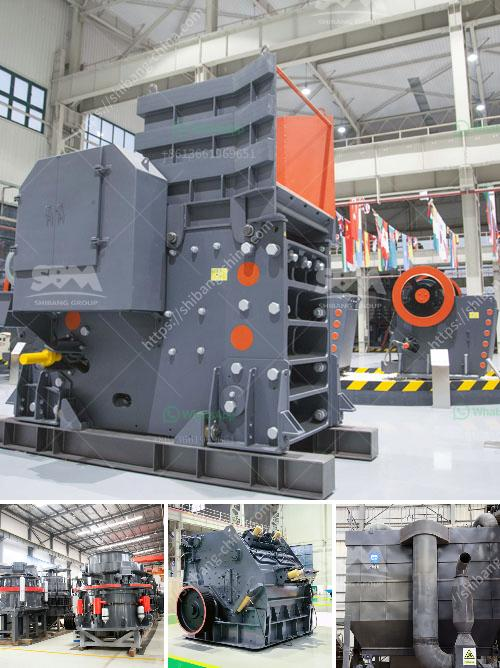

<h3>vertical roller mill suppliers</h3>
Vertical roller mill is a type of industrial equipment used to crush or grind materials into small particles. It is widely used in the concrete and mining fields, and are also used to process gypsum. These units can process both raw and recycled materials, while helping to reduce waste and preserve virgin supplies of these materials.

One of the key advantages of a vertical roller mill is its ability to dry and grind materials all in one go. This eliminates the need for a separate dryer and reduces the amount of energy required. This not only saves on operational costs, but also helps to reduce the carbon footprint of the industry.

With the increasing demand for sustainable and energy-efficient solutions, the vertical roller mill market has witnessed significant growth over the years. As a result, there are now numerous suppliers of vertical roller mills in the market, each offering different features and specifications to meet the diverse needs of customers.

When it comes to choosing a vertical roller mill supplier, there are several factors that one should consider. Firstly, it is important to assess the supplier’s reputation and experience in the industry. A supplier with a good track record and positive customer feedback is more likely to deliver high-quality products and reliable after-sales service.

Secondly, one should evaluate the supplier’s technical expertise and innovation capabilities. A supplier who invests in research and development to improve the performance and efficiency of their vertical roller mills is more likely to offer cutting-edge solutions that can deliver better results in terms of productivity and energy consumption.

Cost is another important factor to consider. While it is tempting to opt for the cheapest option, it is important to strike a balance between cost and quality. Choosing a supplier who offers competitive prices without compromising on the quality and durability of their products can save money in the long run.

Additionally, it is important to evaluate the supplier’s customer support and after-sales service. A reliable supplier should offer technical support to help customers with installation, maintenance, and troubleshooting. They should have a readily available stock of spare parts to ensure uninterrupted operation of the vertical roller mill.

Lastly, it is crucial to assess the supplier’s commitment to sustainability. Suppliers who prioritize environmental considerations and offer energy-efficient solutions can help industries meet their sustainability goals. This can be achieved through the use of advanced technologies, such as low-emission burners and optimized grinding processes.

In conclusion, the choice of a vertical roller mill supplier plays a crucial role in the success of any industry that relies on this equipment. By considering factors such as reputation, technical expertise, cost, customer support, and sustainability, industries can make an informed decision that will optimize their operations and contribute to a more sustainable future.
<h3>Contact us</h3><ul><li><strong>Whatsapp:&nbsp;<a href="https://wa.me/8613661969651">+8613661969651</a></strong></li><li><a href="https://swt.shibang-china.com/?git&amp;zhl&amp;vertical roller mill suppliers"><strong>Online Service(chat now)</strong></a></li></ul><h3>Related</h3><ul><li><a href='mobile rock crusher manufacturers.md'>mobile rock crusher manufacturers</a></li><li><a href='granite quarry crusher equipment.md'>granite quarry crusher equipment</a></li><li><a href='kenya cone crusher is manufactured.md'>kenya cone crusher is manufactured</a></li><li><a href='rock crushing plants.md'>rock crushing plants</a></li><li><a href='coal size used for mills.md'>coal size used for mills</a></li></ul>