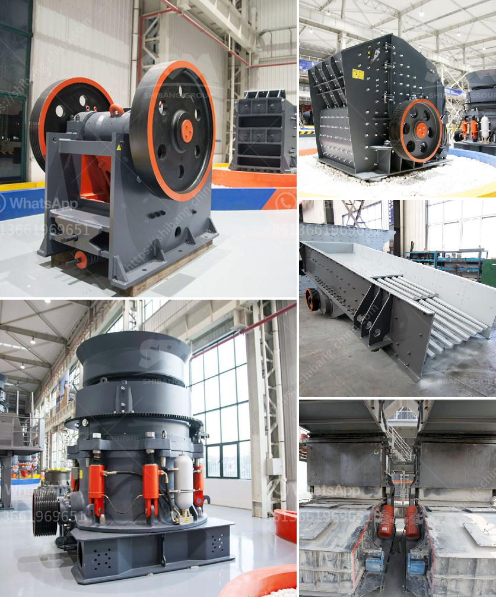

<h3>vertical shaft impact crusher design</h3>
The vertical shaft impact crusher is a common piece of industrial crushing equipment that is widely used around the world in the mining industry. Due to its simple design, compact size, ease of use, and low maintenance requirements, the vertical shaft impact crusher is often utilized for crushing and grinding materials such as construction waste, rock, cement clinker, and more.

The design of a vertical shaft impact crusher incorporates various features like air filtration, high-strength wear-resistant materials, and efficient crushing principles. The unique design of the equipment helps to produce uniform and consistent products with minimal downtime. This versatile machine can be used in various applications, ranging from crushing hard and abrasive rocks to producing high-quality manufactured sand.

One of the key design features of a vertical shaft impact crusher is its rotor, which is responsible for the high-speed motion that results in collision of materials against the crushing chamber. As a result, the impact forces on the material in the chamber are extremely high. Achieving the right combination of rotor design and operational parameters ensures the desired level of performance and product quality.

To enhance the durability of the rotor, manufacturers utilize high-quality steel or other wear-resistant materials. Additionally, many manufacturers employ a modular design for the rotor, allowing for easy replacement of individual parts. This not only reduces downtime but also lowers the overall maintenance cost.

Furthermore, vertical shaft impact crusher manufacturers use the different optimized crushing chamber configurations that enhance the crushing performance of the machine. By changing the rotor speed or cascade ratio, the operator can adjust the crusher’s parameters to maximize production efficiency while minimizing wear on the wear parts.

Another crucial design aspect is the control system, which provides the user with key operational information and makes it easier to adjust and monitor the crusher. Modern crushers often come equipped with advanced automation systems that provide centralized control and continuous monitoring of the system's performance. Moreover, they offer various features like automatic start/stop, load sensing, and even remote control capabilities.

In summary, the vertical shaft impact crusher design provides a versatile and efficient solution for crushing and grinding tasks in the mining industry. With its ability to break down particles of any hardness level, it is essential in producing high-quality materials for various construction applications. As technology advances and more manufacturers seek to improve their crusher designs, the operational parameters, wear parts, and control systems of these machines will continue to evolve, ensuring optimal performance and reduced downtime.
<h3>Contact us</h3><ul><li><strong>Whatsapp:&nbsp;<a href="https://wa.me/8613661969651">+8613661969651</a></strong></li><li><a href="https://swt.shibang-china.com/?git&amp;zhl&amp;vertical shaft impact crusher design"><strong>Online Service(chat now)</strong></a></li></ul><h3>Related</h3><ul><li><a href='ball mill for silica sand.md'>ball mill for silica sand</a></li><li><a href='gold stone crusher and separator.md'>gold stone crusher and separator</a></li><li><a href='mining equipment for hire in kenya.md'>mining equipment for hire in kenya</a></li><li><a href='jaw crushers price.md'>jaw crushers price</a></li><li><a href='coal crusher 350tph.md'>coal crusher 350tph</a></li></ul>