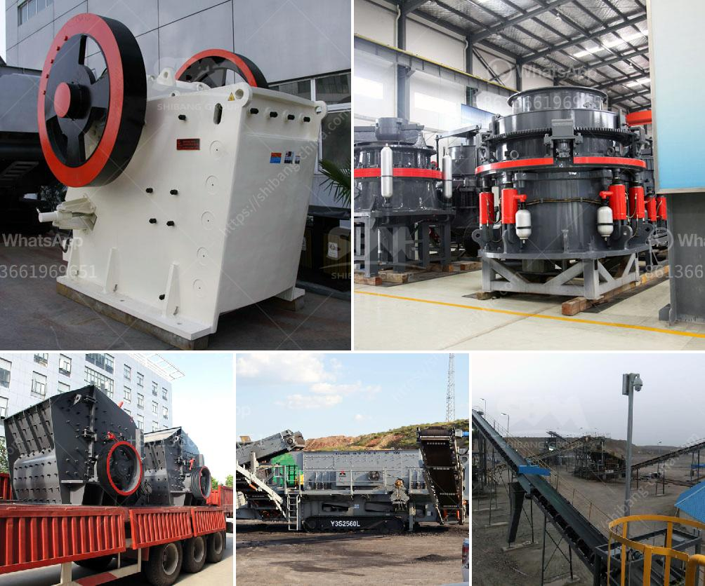

<h3>vertical shaft impact crusher technical specifications</h3>
The vertical shaft impact crusher is a commonly used crushing machine in mining and construction industries for reducing the size of rocks and ores. It has a unique working principle that uses a high-speed rotor with crushing chamber walls lined with anvils to repeatedly collide and crush materials until they are smaller enough to pass through the opening at the bottom.

One of the key advantages of the vertical shaft impact crusher is its ability to efficiently produce cubical-shaped end products. This is achieved through the use of a specialized chamber and an anvil system that provides a constant feed of material and evenly distributes the crushing force. This results in a higher reduction ratio and superior particle shape, making it suitable for applications where a high-quality end product is desired.

In terms of technical specifications, the vertical shaft impact crusher is powered by a motor that delivers a high torque at low speed, which allows the machine to easily withstand the crushing forces and provides excellent durability. It also features a direct drive system that ensures maximum power transfer and precise control over the crushing process.

The vertical shaft impact crusher is available in various sizes and configurations to suit different application requirements. The crusher can be configured as a stationary unit or as a mobile unit with tires or tracks. In terms of capacity, the machine can handle up to 500 tons per hour, making it an ideal choice for large-scale operations.

Overall, the vertical shaft impact crusher is a versatile crushing machine that provides excellent reduction ratios and particle shape. With a range of technical specifications, it can be tailored to suit a variety of application requirements in construction and mining industries. Whether used as a primary, secondary, or tertiary crusher, it ensures efficient operation and high productivity.
<h3>Contact us</h3><ul><li><strong>Whatsapp:&nbsp;<a href="https://wa.me/8613661969651">+8613661969651</a></strong></li><li><a href="https://swt.shibang-china.com/?git&amp;zhl&amp;vertical shaft impact crusher technical specifications"><strong>Online Service(chat now)</strong></a></li></ul><h3>Related</h3><ul><li><a href='crushing and screening of aggregates in mexico.md'>crushing and screening of aggregates in mexico</a></li><li><a href='brick crusher for sale.md'>brick crusher for sale</a></li><li><a href='coal crusher for sale.md'>coal crusher for sale</a></li><li><a href='calcium carbonate plant.md'>calcium carbonate plant</a></li><li><a href='ball milling equipment and milling media.md'>ball milling equipment and milling media</a></li></ul>