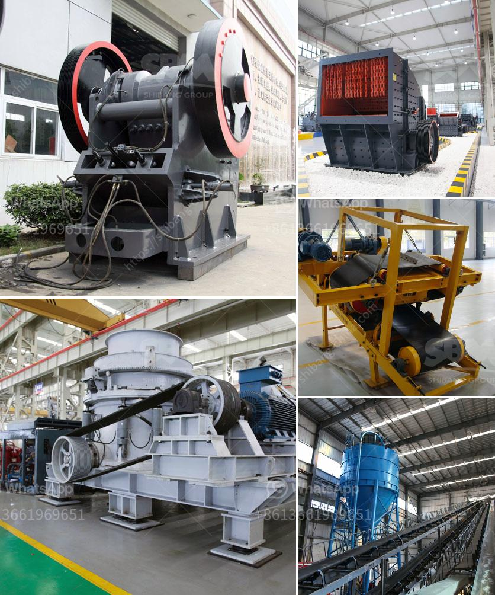

<h3>vertically roller mill pakistan</h3>
The industrial sector in Pakistan has witnessed a remarkable transformation in recent years, with technological advancements playing a pivotal role in its growth. One such groundbreaking innovation is the introduction of vertically roller mills (VRMs) in Pakistan. VRMs have revolutionized the manufacturing processes across various industries, enhancing efficiency, productivity, and sustainability. This article aims to shed light on how VRMs in Pakistan have become the cornerstone of the country's industrial development.

Traditionally, ball mills were the go-to equipment for grinding raw materials in the cement and mining industries. However, the introduction of VRMs has significantly transformed this aspect of industrial operations in Pakistan. VRMs utilize a rotating table equipped with rollers that grind raw materials to a fine powder. This vertical design ensures efficient and uniform grinding, resulting in a higher-quality end product.

Energy consumption is a significant concern for any industrial sector. VRMs in Pakistan have proven to be highly energy-efficient compared to their predecessors. Their vertical orientation minimizes energy wastage and lowers the overall carbon footprint. The capability to grind materials at a higher pressure point and the implementation of advanced control systems allow VRMs to optimize the grinding process, reducing energy consumption by up to 40% compared to ball mills.

The implementation of advanced technologies in VRMs has allowed for better control over the milling process. These innovative control systems regulate the flow of materials, adjust grinding pressure, and maintain a consistent product quality. The precise control achieved through VRMs ensures the desired fineness and particle size distribution, enabling manufacturers in Pakistan to meet stringent quality standards.

VRMs have a compact design and require minimal floor space, making them ideal for industries operating in limited areas. Furthermore, the simplified structure of VRMs minimizes the number of moving parts, resulting in reduced maintenance requirements and lower downtime for maintenance-related activities. This advantage plays a crucial role in optimizing production schedules and meeting market demands promptly.

With increasing awareness of environmental concerns, the adoption of sustainable technologies is crucial for industries in Pakistan. VRMs offer a greener alternative by significantly reducing carbon emissions and energy consumption compared to conventional milling systems. The smaller footprint and lower noise pollution make VRMs a preferred choice for industries seeking to minimize their impact on the environment.

The implementation of vertically roller mills in Pakistan's industrial sector has brought about a transformative change. The advanced grinding mechanisms, enhanced energy efficiency, improved milling control, reduced maintenance requirements, and positive environmental impact have made VRMs the preferred choice for many industries. Pakistan's cement, mining, and other manufacturing sectors have experienced accelerated growth and development as a result of incorporating VRMs into their production processes. As the country moves towards a sustainable and technologically advanced future, the role of VRMs in shaping the industrial landscape cannot be understated.
<h3>Contact us</h3><ul><li><strong>Whatsapp:&nbsp;<a href="https://wa.me/8613661969651">+8613661969651</a></strong></li><li><a href="https://swt.shibang-china.com/?git&amp;zhl&amp;vertically roller mill pakistan"><strong>Online Service(chat now)</strong></a></li></ul><h3>Related</h3><ul><li><a href='crushing plant pdf.md'>crushing plant pdf</a></li><li><a href='terrex stone crushers in usa.md'>terrex stone crushers in usa</a></li><li><a href='mining equipment for hire in kenya.md'>mining equipment for hire in kenya</a></li><li><a href='ball milling equipment and milling media.md'>ball milling equipment and milling media</a></li><li><a href='stone crusher plants peru.md'>stone crusher plants peru</a></li></ul>