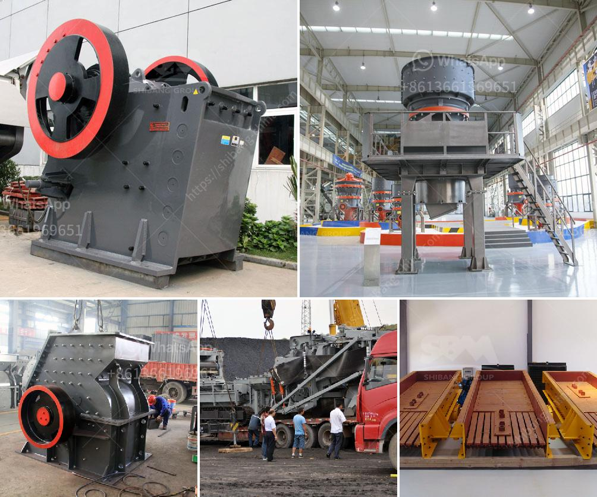

<h3>vibrating feeder for jaw crusher</h3>
A vibrating feeder is a machine that feeds large bulk materials into a crusher efficiently and evenly. It is commonly used in metallurgy, mining, coal, building materials, chemical industry, electric power, food, and other industries. The vibrating feeder usually adopts a linear vibrating feeding method. It has the characteristics of stable vibration, reliable operation, long service life, and convenient adjustment. Therefore, it is widely used in crushing and screening plants of mining, metallurgy, coal, building materials, chemical industry, and other industries.

The vibrating feeder is mainly composed of a vibration exciter, spring support, transmission device, and other components. The vibration exciter is composed of two eccentric shafts (main and passive) and a gear pair. The motor drives the main shaft through a V-belt, and the main shaft drives the drive shaft through a gear pair, thus rotating and reciprocating the vibration exciter. The material continuously moves forward under the action of the vibration exciter, and the crushing equipment continuously crushes and screens the material.

The vibrating feeder has several advantages in the production process. First, it can transport the materials to the next crusher or screening equipment evenly, avoiding the uneven feeding caused by the excessive feeding of the crusher. Second, it can improve the production efficiency of the crushing equipment, as it can effectively avoid the blockage of the crusher. Third, the vibrating feeder can separate the soil and other impurities in advance, reducing the wear of the crusher and extending its service life. Fourth, it has a variety of models and specifications, which can meet different production requirements.

When using a vibrating feeder, there are several points that need attention. Firstly, the operator should regularly observe whether the amplitude and vibration times of the vibrating feeder are stable. If abnormal phenomena such as violent vibration or no vibration occur, it is necessary to stop immediately for inspection and troubleshooting. Secondly, it is important to check the lubrication of the vibrator regularly and add lubricating oil in time to ensure the normal operation of the equipment. Lastly, the materials should be evenly and smoothly fed into the crusher to prevent overloading, which may lead to equipment failure.

In conclusion, the vibrating feeder is an important accessory equipment for the jaw crusher. It helps to effectively and efficiently transport large bulk materials into the crusher, ensuring smooth production and improving the crushing efficiency. With its stable vibration, reliable operation, and long service life, the vibrating feeder has become an essential machine in the crushing and screening plants of various industries.
<h3>Contact us</h3><ul><li><strong>Whatsapp:&nbsp;<a href="https://wa.me/8613661969651">+8613661969651</a></strong></li><li><a href="https://swt.shibang-china.com/?git&amp;zhl&amp;vibrating feeder for jaw crusher"><strong>Online Service(chat now)</strong></a></li></ul><h3>Related</h3><ul><li><a href='coal grinding mill in india.md'>coal grinding mill in india</a></li><li><a href='dolomite ball mill price.md'>dolomite ball mill price</a></li><li><a href='talc rock crusher.md'>talc rock crusher</a></li><li><a href='crushing plant and equipment.md'>crushing plant and equipment</a></li><li><a href='crushed stone products mwanza tanzania.md'>crushed stone products mwanza tanzania</a></li></ul>