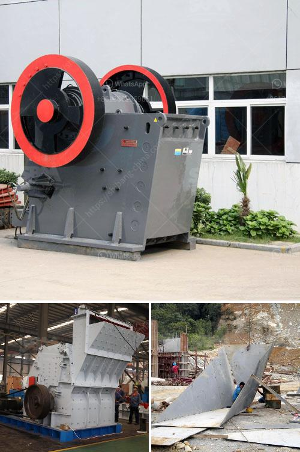

<h3>vibrating grizzly feeder 35 ton per jam</h3>
The vibrating grizzly feeder is an essential piece of equipment in the crushing and screening process of any stone quarry or mining operation. It is used to separate large rocks and stones from the smaller ones, making it easier to transport and further process the materials.

One popular model of vibrating grizzly feeder is the 35-ton per jam unit. This means that it has a capacity to handle 35 tons of material per hour. It is designed to efficiently and consistently feed large quantities of rock and stone to the primary crusher, which is often a jaw crusher.

The vibrating grizzly feeder consists of a vibrating pan deck, which is supported by a set of sturdy springs attached to a stationary frame. The pan deck is driven by a vibrating motor, which causes it to vibrate and move the material forward. This movement creates a constant flow of material onto the conveyor belt or into the crusher.

What sets the vibrating grizzly feeder apart from other types of feeders is its ability to handle large rocks and stones without causing any damage to the equipment. The grizzly bars, which are spaced apart on the pan deck, help to separate the oversized materials from the smaller ones. The oversized materials are then directed to a separate area or crusher, while the smaller materials continue on their way.

The vibrating grizzly feeder also plays a crucial role in preventing the crusher from being overloaded. By regulating the feed rate, it ensures that the crusher is supplied with a consistent and manageable amount of material at all times. This not only prevents the crusher from becoming overwhelmed but also helps to optimize its performance and extend its lifespan.

Furthermore, the vibrating grizzly feeder improves the efficiency of the overall crushing and screening process. By removing the fines and dust from the material before it enters the crusher, it helps to reduce wear and tear on the equipment and improve the quality of the final product. In addition, it can also be used to scalp or screen the material, further enhancing the efficiency and productivity of the operation.

Overall, the vibrating grizzly feeder is a crucial piece of equipment that plays a significant role in the crushing and screening process. With its ability to handle large volumes of material and prevent overloading of the crusher, it ensures the smooth and efficient operation of the entire system. Whether it is used in a stone quarry or a mining operation, the vibrating grizzly feeder is a valuable asset that saves time, money, and resources.
<h3>Contact us</h3><ul><li><strong>Whatsapp:&nbsp;<a href="https://wa.me/8613661969651">+8613661969651</a></strong></li><li><a href="https://swt.shibang-china.com/?git&amp;zhl&amp;vibrating grizzly feeder 35 ton per jam"><strong>Online Service(chat now)</strong></a></li></ul><h3>Related</h3><ul><li><a href='cost of starting a quarry business.md'>cost of starting a quarry business</a></li><li><a href='how much investment needed to start a crusher in canada.md'>how much investment needed to start a crusher in canada</a></li><li><a href='buy sand washing plant in sri lanka.md'>buy sand washing plant in sri lanka</a></li><li><a href='zimbabwe mobile crusher rentals.md'>zimbabwe mobile crusher rentals</a></li><li><a href='calcium carbonate grinding mill price.md'>calcium carbonate grinding mill price</a></li></ul>