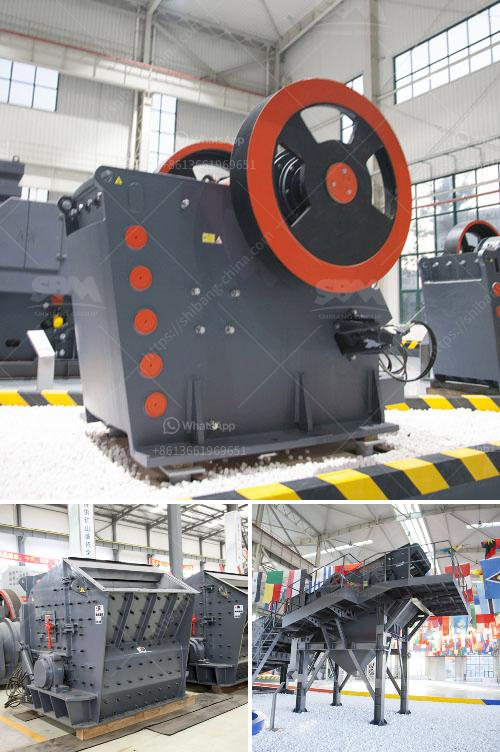

<h3>vibrating screen estimating</h3>
The vibrating screen is an essential piece of equipment in many industrial and mining processes. Its primary function is to separate materials based on size, allowing for efficient and effective screening operations. Estimating the performance and capacity of a vibrating screen is crucial for optimizing its usage and ensuring its longevity.

Estimating the performance of a vibrating screen involves determining various factors, such as the screen capacity, efficiency, and opening size. These factors play a significant role in determining the screen's ability to process materials effectively.

One essential factor to consider is screen capacity, which refers to the maximum amount of material a vibrating screen can handle at a given time. Estimating the screen capacity requires taking into account factors like the material's bulk density, moisture content, and desired efficiency. A higher screen capacity allows for faster processing, increasing overall productivity.

Efficiency is another crucial factor in estimating vibrating screen performance. It indicates the screen's ability to separate materials accurately and efficiently. Estimating efficiency involves assessing factors like the screen's inclination angle, stroke length, and RPM. High efficiency ensures that the screen effectively separates undersized particles, maximizes material throughput, and minimizes the risk of material blinding or pegging.

Opening size is an important consideration in estimating the performance of a vibrating screen. It defines the size of the screening media, such as wire mesh or perforated plate, allowing the separation of materials based on their size. Accurately determining the opening size requires considering factors like the desired particle size distribution and the characteristics of the material being screened. Choosing the appropriate opening size ensures effective particle separation and enhances screening accuracy.

There are several methods available for estimating vibrating screen performance. One commonly used approach is empirical formulas, which provide a rough estimation based on mathematical models derived from empirical data. These formulas consider parameters like screen width, length, inclination angle, and material properties, allowing for a preliminary estimation of screen capacity and efficiency.

Another approach is computer simulation using specialized software. This method provides a more accurate estimation by modeling the complex interactions of materials and screen motion. Simulation software can account for factors like particle shape, screen motion trajectory, and screen deck design, offering a detailed analysis of screen performance. Computer simulation allows engineers to optimize screen design and operation parameters to enhance efficiency and minimize maintenance costs.

Overall, estimating the performance of a vibrating screen is essential for maximizing its efficiency and longevity. Accurate estimations of factors like screen capacity, efficiency, and opening size enable operators and engineers to choose the most suitable screen for their specific application and optimize its performance. By utilizing empirical formulas or computer simulations, companies can make informed decisions regarding screen design, operation parameters, and maintenance schedules.

In conclusion, vibrating screen estimating is a valuable tool for efficient screening operations. By accurately estimating factors like screen capacity, efficiency, and opening size, companies can enhance their screening processes, maximize material throughput, and improve overall operational efficiency. Whether using empirical formulas or computer simulations, investing in estimating vibrating screen performance can lead to significant cost savings and improved productivity in various industries.
<h3>Contact us</h3><ul><li><strong>Whatsapp:&nbsp;<a href="https://wa.me/8613661969651">+8613661969651</a></strong></li><li><a href="https://swt.shibang-china.com/?git&amp;zhl&amp;vibrating screen estimating"><strong>Online Service(chat now)</strong></a></li></ul><h3>Related</h3><ul><li><a href='small scale rock crusher.md'>small scale rock crusher</a></li><li><a href='second hand ball mill manufacturer in india.md'>second hand ball mill manufacturer in india</a></li><li><a href='bradley grinding mill price.md'>bradley grinding mill price</a></li><li><a href='limestone grinding mill china.md'>limestone grinding mill china</a></li><li><a href='bentonite granules making machinery india.md'>bentonite granules making machinery india</a></li></ul>