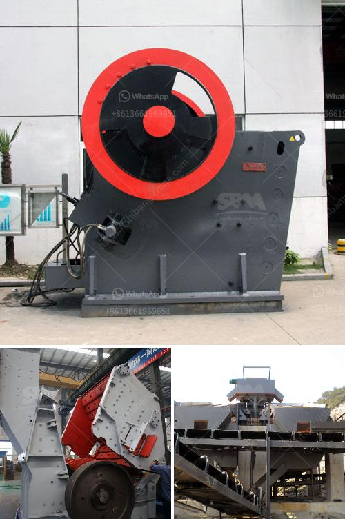

<h3>vibrating screen feeder</h3>
A vibrating screen feeder is a device that utilizes vibrations to feed material into a process or machine. Vibratory feeders use vibrations and gravity to move materials. They are designed to feed fine to large-sized materials at the highest processing speeds. Vibrating screen feeders are used to screen bulk materials with a high efficiency rate. This type of feeder enhances the performance and productivity of processing plants.

The vibrating screen feeder consists of a vibrating mechanism, an acceleration device, a feed tray, a screening medium, and the drive unit. These components work together efficiently to create a controlled flow of materials to the machine or process. The vibrating mechanism is responsible for activating the vibrations that move the materials. The acceleration device enhances the amplitude of the vibrations, allowing for a greater level of screening efficiency.

A key feature of a vibrating screen feeder is its ability to adjust the feed rate. Operators can adjust the speed and amplitude of the vibrations to meet the specific needs of the application. This allows for a consistent and controlled feed rate, minimizing product variability and ensuring optimal performance. Additionally, the adjustable feed rate helps prevent the overloading of screens or machines, prolonging their lifespan and reducing maintenance costs.

Vibrating screen feeders are commonly used in mining operations, aggregate plants, mineral processing, and recycling industries. They are versatile machines that can handle a wide range of materials, including heavy-duty rocks, minerals, sand, and gravel. The efficient screening action of these feeders ensures the separation and classification of materials according to size.

In conclusion, vibrating screen feeders are essential devices for many industries. They provide a reliable and efficient solution for handling bulk materials. Whether it is processing, screening, or feeding, these feeders excel in their ability to enhance productivity and improve overall process efficiency. With their adjustable feed rate and high processing speeds, vibrating screen feeders are indispensable in modern processing plants.
<h3>Contact us</h3><ul><li><strong>Whatsapp:&nbsp;<a href="https://wa.me/8613661969651">+8613661969651</a></strong></li><li><a href="https://swt.shibang-china.com/?git&amp;zhl&amp;vibrating screen feeder"><strong>Online Service(chat now)</strong></a></li></ul><h3>Related</h3><ul><li><a href='marble and granite plant.md'>marble and granite plant</a></li><li><a href='primary crushers.md'>primary crushers</a></li><li><a href='used asphalt plants for sale in japan.md'>used asphalt plants for sale in japan</a></li><li><a href='concrete aggregate recycle machine.md'>concrete aggregate recycle machine</a></li><li><a href='ball mills for mining in china.md'>ball mills for mining in china</a></li></ul>