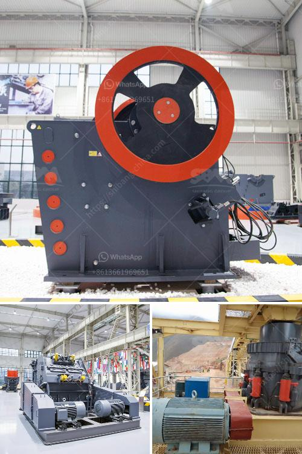

<h3>vibrating screen for sale philippines</h3>
The Vibrating Screen for Sale Philippines is a widely used screening equipment in the mining industry. It is also frequently used in other industries such as construction, metallurgy, and chemical industries. It is used to separate materials into various sizes for further processing or for end use, depending on the project’s requirements.

The Vibrating Screen uses a vibratory motion to ensure that the material passes through the screen surface in a straight line. This motion is accomplished by an eccentric shaft with one or more unbalanced weights fixed on it. The vibrating action separates the particles by size, ensuring efficient and effective screening.

There are several types of Vibrating Screens for Sale in the Philippines, including inclined screens and horizontal screens. Inclined screens are mainly used for aggregate processing applications, while horizontal screens are typically used for mining operations. Both types are capable of handling a wide range of materials, including coal, limestone, crushed stone, gravel, and ores.

One of the key advantages of Vibrating Screens is their ability to screen and separate materials efficiently. This results in higher productivity and reduced downtime. The screens are designed with multiple decks, enabling the simultaneous screening of different particle sizes. This is especially useful in applications where multiple products are required.

Another advantage of Vibrating Screens is their versatility. They can be used for both wet and dry screening, making them suitable for a variety of materials and environments. The screen surfaces are typically made of high-quality materials such as rubber or polyurethane, ensuring durability and long-lasting performance.

When choosing a Vibrating Screen for Sale in the Philippines, it is important to consider several factors. First and foremost, the screen should be suitable for the application and able to handle the specific requirements of the project. This includes factors such as the desired particle size, capacity, and material characteristics.

It is also important to consider the overall quality and reliability of the screen. Look for screens manufactured by trusted brands with a reputation for producing high-quality equipment. This ensures that the screen will perform optimally and have a longer lifespan, reducing the need for frequent replacements.

Additionally, consider the after-sales service and support provided by the supplier. It is beneficial to work with a supplier that offers comprehensive support, including installation, maintenance, and repair services. This ensures that any issues can be addressed promptly, minimizing downtime and maximizing productivity.

In conclusion, the Vibrating Screen for Sale Philippines is a valuable screening equipment used in various industries. They offer efficient and effective screening, enabling the separation of materials into different sizes for further processing. When choosing a vibrating screen, it is important to consider factors such as the application, quality, and after-sales support. By making the right choice, businesses can maximize productivity and achieve their screening goals.
<h3>Contact us</h3><ul><li><strong>Whatsapp:&nbsp;<a href="https://wa.me/8613661969651">+8613661969651</a></strong></li><li><a href="https://swt.shibang-china.com/?git&amp;zhl&amp;vibrating screen for sale philippines"><strong>Online Service(chat now)</strong></a></li></ul><h3>Related</h3><ul><li><a href='stone crusher in germany.md'>stone crusher in germany</a></li><li><a href='sand screen machine.md'>sand screen machine</a></li><li><a href='stone crusher discount.md'>stone crusher discount</a></li><li><a href='mobile crushing stone machines from austria.md'>mobile crushing stone machines from austria</a></li><li><a href='sale for stone crusher.md'>sale for stone crusher</a></li></ul>