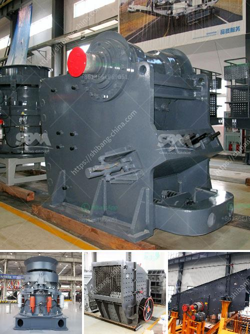

<h3>vibrating screen manufacturers</h3>
Vibrating screens are widely used in various industrial applications due to their ability to efficiently separate and process bulk materials. These screens have become an integral part of many processes in industries such as mining, building materials, metallurgy, chemical, and pharmaceutical.

When it comes to vibrating screen manufacturers, there is a plethora of companies out there. However, selecting the right manufacturer can be a challenging task as not all manufacturers provide high-quality products. In this article, we will discuss some of the top vibrating screen manufacturers in the industry.

One of the leading players in the vibrating screens market is Osborn. With over a century of experience, Osborn is a well-established manufacturer of vibrating equipment. Its robust and reliable screens are designed to handle a wide range of materials and applications. Osborn offers a range of screens such as horizontal, inclined, multi-slope, and dewatering screens.

Another prominent manufacturer is FLSmidth, which has been in the business for more than a century. FLSmidth is known for its high-quality vibrating screens that are built to last. The company's screens come in various sizes and types, including banana screens, horizontal screens, high-frequency screens, and inclined screens. FLSmidth also provides customized solutions to meet specific customer requirements.

Derrick Corporation is another reputable vibrating screen manufacturer that has been in business for more than 60 years. Derrick screens are known for their high-efficiency performance and long lifespan. The company offers a wide range of screens, including dry fine screening and dewatering screens, as well as a unique double-frequency vibrating screen for enhanced efficiency.

Metso Outotec is a global leader in vibrating screen manufacturing, catering to various industries with its comprehensive range of screens. Metso Outotec's screens are known for their high-capacity and high-efficiency performance. The company offers various types of screens, including horizontal, inclined, banana, and dewatering screens.

These are just a few examples of reputable vibrating screen manufacturers. When selecting a manufacturer, it is crucial to consider factors such as the company's experience, product quality, customer reviews, and after-sales service. It is also important to determine the specific requirements of your application and ensure that the manufacturer can provide a suitable solution.

In conclusion, vibrating screens play a vital role in various industries, and selecting the right manufacturer is essential to ensure high-quality products and efficient performance. Osborn, FLSmidth, Derrick Corporation, and Metso Outotec are some of the well-established manufacturers in the industry. However, it is always recommended to thoroughly research and compare different manufacturers before making a final decision.
<h3>Contact us</h3><ul><li><strong>Whatsapp:&nbsp;<a href="https://wa.me/8613661969651">+8613661969651</a></strong></li><li><a href="https://swt.shibang-china.com/?git&amp;zhl&amp;vibrating screen manufacturers"><strong>Online Service(chat now)</strong></a></li></ul><h3>Related</h3><ul><li><a href='how to make talcum powder in the escapists.md'>how to make talcum powder in the escapists</a></li><li><a href='concrete crusher hire nigeria.md'>concrete crusher hire nigeria</a></li><li><a href='crusher machine for marble and granite.md'>crusher machine for marble and granite</a></li><li><a href='rod mill for sale perth.md'>rod mill for sale perth</a></li><li><a href='cement concrete crusher equipment.md'>cement concrete crusher equipment</a></li></ul>