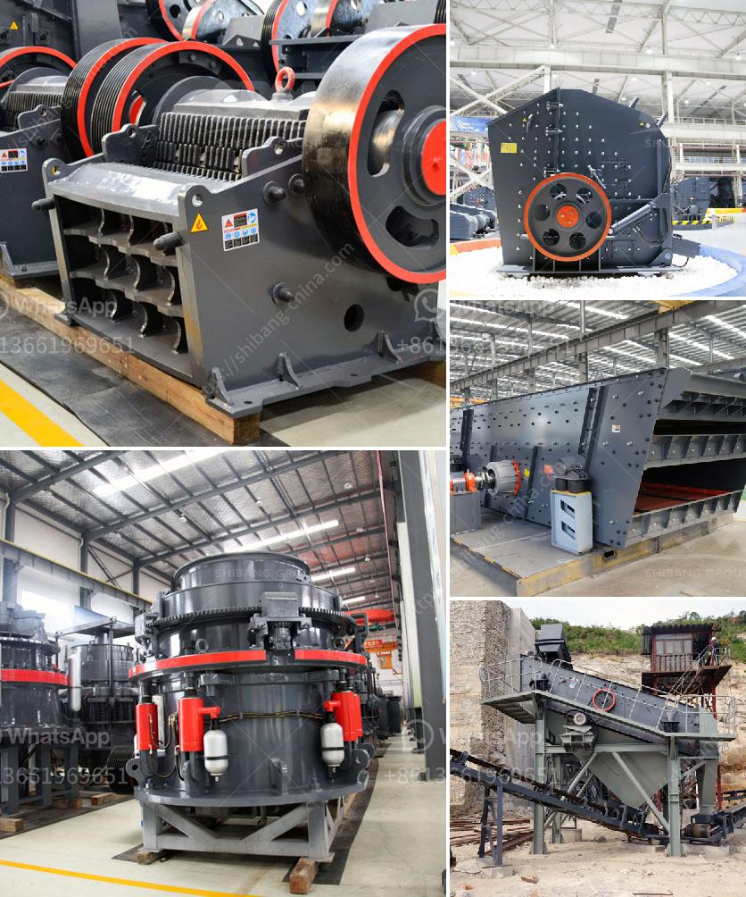

<h3>vibrating screen manufacturing process</h3>
Vibrating screens are used to separate bulk materials from solid and liquid forms. The manufacturing process of vibrating screens is quite intricate as it involves the use of multiple components and advanced techniques.

Firstly, the fabricators prepare the different parts of the vibrating screen like side plates, cross bars, beams, exciter parts, and decks. After cutting these parts from a raw material sheet, they are shaped and bent based on the design specifications.

Once the parts are ready, they are sent for surface treatment processes like sandblasting or shot blasting. This step ensures that the parts are free from any impurities and have a smooth surface finish. Surface treatment enhances the overall appearance and durability of the vibrating screen.

The next step involves assembling the various parts to create the complete vibrating screen. This process requires great precision and attention to detail as any miscalculation can lead to improper functioning of the screen. The side plates are attached to the cross bars and beams using appropriate fasteners like bolts and nuts.

After the main structure is assembled, the exciter parts are integrated into the vibrating screen. These exciter parts consist of eccentric weights and bearing housings that generate the necessary vibrations for efficient material separation. The exciter parts are carefully aligned and securely attached to ensure smooth operation.

Finally, the decks, which are the sieving surfaces of the vibrating screen, are attached to the main structure. The number of decks can vary based on the application requirements. Once the decks are installed, the vibrating screen undergoes rigorous testing and quality checks to ensure its performance and reliability.

In summary, the manufacturing process of vibrating screens involves cutting and shaping various parts, surface treatment, precise assembly, integration of exciter parts, and attachment of decks. Each step requires expertise and careful attention to detail to achieve a high-quality vibrating screen that meets customer requirements.
<h3>Contact us</h3><ul><li><strong>Whatsapp:&nbsp;<a href="https://wa.me/8613661969651">+8613661969651</a></strong></li><li><a href="https://swt.shibang-china.com/?git&amp;zhl&amp;vibrating screen manufacturing process"><strong>Online Service(chat now)</strong></a></li></ul><h3>Related</h3><ul><li><a href='limestone impact crusher.md'>limestone impact crusher</a></li><li><a href='mobile gold processing plant for sale.md'>mobile gold processing plant for sale</a></li><li><a href='used vsi crusher for sale in india.md'>used vsi crusher for sale in india</a></li><li><a href='setting up a quarry in nigeria.md'>setting up a quarry in nigeria</a></li><li><a href='sand gold crusher equipment made in canada.md'>sand gold crusher equipment made in canada</a></li></ul>