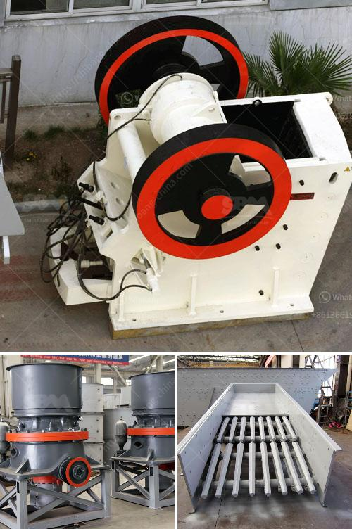

<h3>vibrating screens usa</h3>
Vibrating screens have been an important part of material processing in various industries for many years. However, their significance and usage in the mining sector cannot be overstated, as they play a crucial role in the extraction and sorting of minerals. In the United States, the demand for reliable and efficient vibrating screens has led to the emergence of several prominent manufacturers, making the country a key player in this industry.

One of the primary reasons for the widespread use of vibrating screens in the mining industry is their ability to efficiently and effectively separate different-sized particles. By using multiple decks and varying screen sizes, vibrating screens can sort mined materials into different fractions, enabling further processing and refinement. This sorting process is essential for mining operations as it allows for the extraction of valuable minerals and ensures that only the desired particle sizes are sent for further processing, reducing waste and optimizing resource utilization.

In the USA, there are several manufacturers catering specifically to the mining industry's vibrating screen requirements. These manufacturers offer a wide range of vibrating screens, including linear motion screens, circular motion screens, high-frequency screens, and multi-slope screens. Each type of screen has unique features and advantages, allowing mining companies to choose the most suitable option based on their specific needs, such as particle size, production capacity, and material type.

One prominent manufacturer in the USA is Corporation, a global leader in the design and manufacture of vibrating screens for mining applications. The company's extensive portfolio includes various types of screens that are known for their durability, reliability, and efficient performance. Their screens are designed with advanced technology to handle high-tonnage loads, ensuring uninterrupted operations even in the most demanding mining environments.

Another USA-based manufacturer that has made a significant impact in the mining sector is Deister Machine Company. With over 100 years of experience, Deister is known for its robust vibrating screens that can handle heavy-duty applications. The company's screens are designed to withstand harsh conditions, such as abrasive materials and extreme temperatures, providing mining operators with reliable equipment that requires minimal maintenance.

Apart from manufacturing vibrating screens, several USA-based companies also offer comprehensive after-sales support, including installation, maintenance, and technical assistance. This ensures that mining companies can optimize the performance of their vibrating screens and minimize downtime, ultimately improving their overall operational efficiency.

In conclusion, vibrating screens play a vital role in the mining industry by enabling the effective separation and sorting of materials. The United States has emerged as a key player in this sector, with several reputable manufacturers offering a diverse range of vibrating screens designed specifically for mining applications. These screens, known for their durability, efficiency, and reliability, are essential for enhancing productivity and maximizing resource utilization in the mining industry. The continuous advancements in technology and the ongoing commitment of manufacturers to provide innovative solutions ensure that vibrating screens will remain a crucial component in the mining industry's operations in the USA.
<h3>Contact us</h3><ul><li><strong>Whatsapp:&nbsp;<a href="https://wa.me/8613661969651">+8613661969651</a></strong></li><li><a href="https://swt.shibang-china.com/?git&amp;zhl&amp;vibrating screens usa"><strong>Online Service(chat now)</strong></a></li></ul><h3>Related</h3><ul><li><a href='vibrating screen manufacturers.md'>vibrating screen manufacturers</a></li><li><a href='granite and marble business plan pdf.md'>granite and marble business plan pdf</a></li><li><a href='machine supplier of stone crusher in philippines.md'>machine supplier of stone crusher in philippines</a></li><li><a href='small quartz appratus for crushing.md'>small quartz appratus for crushing</a></li><li><a href='equipo del molino de bolas 750 hp precio del motor.md'>equipo del molino de bolas 750 hp precio del motor</a></li></ul>