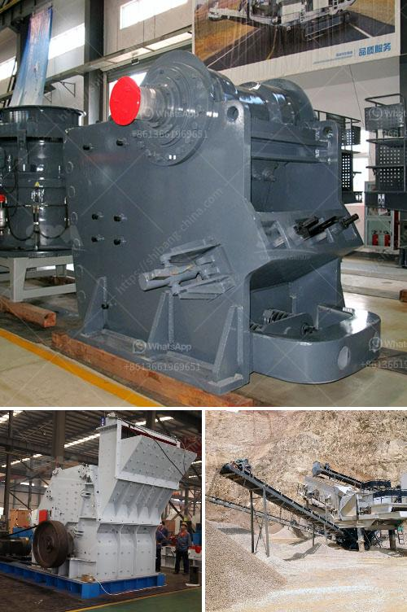

<h3>want to lease diamond mining equipment in south africa</h3>
If you have been contemplating the idea of starting a diamond mining business in South Africa, you might have considered various aspects such as financing, location, permits, and equipment. As you proceed with establishing your venture, one significant factor that cannot be overlooked is acquiring the necessary mining equipment. However, purchasing the equipment outright may not always be the most feasible option, especially if you are just starting out or have limited financial resources. In such cases, leasing diamond mining equipment can prove to be a smart and strategic move.

When it comes to leasing mining equipment in South Africa, it is important to first understand the concept of equipment leasing. Leasing involves renting the machinery or equipment for a specific period, usually on a monthly basis, against a predetermined fee. This allows businesses to access the required equipment without having to bear the burden of the full purchase cost. It also ensures flexibility, as you can return or upgrade the equipment once the lease term ends, depending on your business requirements.

Leasing diamond mining equipment provides several advantages for your business. One of the key benefits is the preservation of capital. Starting a mining operation requires considerable capital investment, and channeling a substantial portion of it towards equipment procurement might put undue strain on your finances. By opting for equipment leasing, you can preserve your capital and allocate it to other vital areas of your business, such as hiring skilled workers, marketing, and infrastructure development.

Another advantage of leasing diamond mining equipment is the flexibility it offers. Mining operations often face changing demands and fluctuating market conditions. By leasing the equipment instead of purchasing it, you have the freedom to upgrade or replace the machinery as per your requirements. This ensures that your mining operation remains competitive and efficient, with access to the latest technology and equipment.

Furthermore, leasing equipment eliminates the headache of maintenance and repairs. The leasing company typically takes care of regular maintenance and repairs during the lease period, ensuring that the equipment is in optimal condition. This saves you from additional expenses and allows you to focus on your core mining operations.

When considering equipment leasing in South Africa, it is essential to choose a reputable leasing company that specializes in the mining industry. Look for a company that offers reliable and well-maintained equipment, along with flexible lease terms and competitive pricing. Conduct thorough research, read customer reviews, and compare leasing options to make an informed decision.

In conclusion, leasing diamond mining equipment in South Africa is a practical alternative for businesses that want to start or expand their mining operations. Leasing provides the opportunity to access high-quality mining equipment without the substantial upfront costs. It also ensures flexibility, allowing businesses to upgrade or change equipment as needed. By choosing a trusted leasing company, you can maximize your chances of success in the diamond mining industry while minimizing financial strain.
<h3>Contact us</h3><ul><li><strong>Whatsapp:&nbsp;<a href="https://wa.me/8613661969651">+8613661969651</a></strong></li><li><a href="https://swt.shibang-china.com/?git&amp;zhl&amp;want to lease diamond mining equipment in south africa"><strong>Online Service(chat now)</strong></a></li></ul><h3>Related</h3><ul><li><a href='machine supplier of stone crusher in philippines.md'>machine supplier of stone crusher in philippines</a></li><li><a href='second hand quarry cruher equipment price south africa.md'>second hand quarry cruher equipment price south africa</a></li><li><a href='german made stone crushers.md'>german made stone crushers</a></li><li><a href='cement plant equipment catalogue pdf.md'>cement plant equipment catalogue pdf</a></li><li><a href='changchai ballast crusher.md'>changchai ballast crusher</a></li></ul>