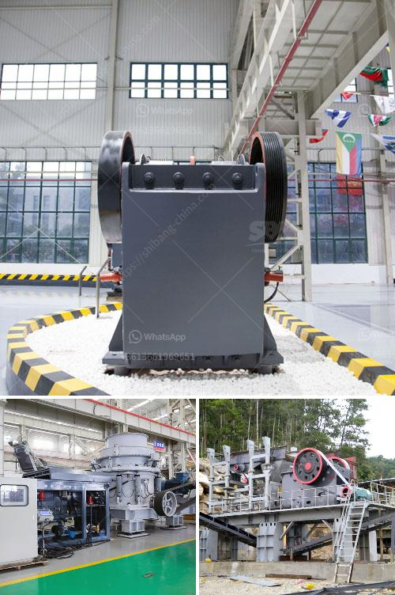

<h3>washing plant setup cost south africa</h3>
The mining industry is one of the key sectors driving the economic growth of South Africa. With the country being rich in important minerals such as platinum, coal, and gold, the mining sector is considered to be one of the pillars of South Africa's economy.

One crucial step in modern mining operations is the washing plant setup. This process involves the removal of impurities from the mined ore, resulting in a higher-quality product that can be further processed or sold. As such, investing in a reliable and efficient washing plant setup is essential for mining companies to optimize their operations and increase their profits.

When considering the setup cost of a washing plant in South Africa, several factors need to be taken into account. Firstly, the location of the plant plays a significant role in determining the overall cost. Building a washing plant near the mining site reduces transportation costs and enables easy access to the raw materials. However, locating the plant close to the mining site may also present challenges, such as limited space and potential environmental concerns.

Another important factor is the size and capacity of the washing plant. Larger plants with higher throughput capacity are generally more expensive to set up. The size of the plant depends on the expected production volume and the type of minerals being processed. For instance, a washing plant designed for processing coal would differ from one intended for processing gold or platinum.

The type of technology used in the washing plant also affects the setup cost. There are various washing plant designs available, ranging from simple jigs to more complex and automated systems. Modern washing plants often incorporate advanced technologies such as flotation, magnetic separation, and gravity separation to ensure optimum mineral recovery. While these advanced technologies can increase the initial setup cost, they also result in higher efficiencies, lower operating costs, and superior product quality in the long run.

Additionally, labor costs are a significant consideration when establishing a washing plant. South Africa has a well-developed pool of skilled labor in the mining industry, making it more cost-effective to hire and train local workers. However, labor costs can still vary depending on the level of automation and the complexity of the washing plant setup.

Lastly, regulatory requirements and compliance with environmental standards can influence the setup cost. Mining companies need to adhere to strict regulations to mitigate the environmental impact of their operations. This may involve implementing water recycling systems, dust control measures, and waste management protocols – all of which add to the overall cost of establishing and maintaining a washing plant.

In conclusion, the setup cost of a washing plant in South Africa depends on various factors, including location, size, technology, labor costs, and regulatory compliance. While the initial investment may be significant, a well-designed and efficiently operated washing plant can lead to higher productivity, improved ore quality, and increased profitability for mining companies. Therefore, carefully evaluating these factors and making informed decisions in the setup process is crucial for the long-term success and sustainability of mining operations in South Africa.
<h3>Contact us</h3><ul><li><strong>Whatsapp:&nbsp;<a href="https://wa.me/8613661969651">+8613661969651</a></strong></li><li><a href="https://swt.shibang-china.com/?git&amp;zhl&amp;washing plant setup cost south africa"><strong>Online Service(chat now)</strong></a></li></ul><h3>Related</h3><ul><li><a href='complete crushing plant 100tph.md'>complete crushing plant 100tph</a></li><li><a href='marble powder crusher plant.md'>marble powder crusher plant</a></li><li><a href='rock processing plant.md'>rock processing plant</a></li><li><a href='used stone crusher for sale europe.md'>used stone crusher for sale europe</a></li><li><a href='concrete aggregate recycle machine.md'>concrete aggregate recycle machine</a></li></ul>