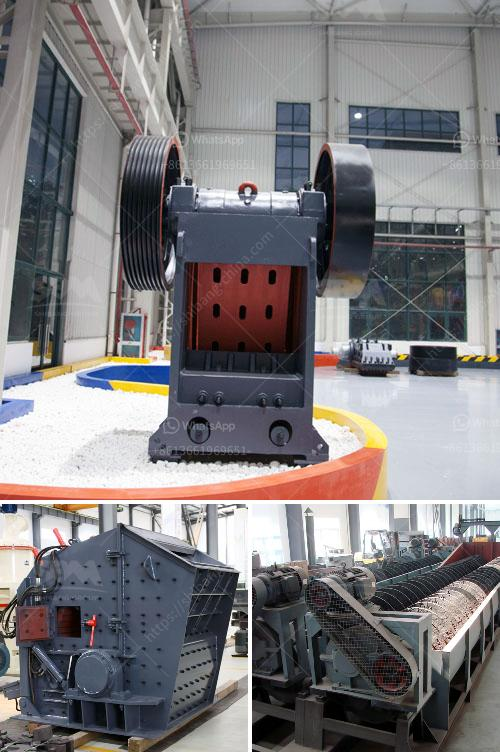

<h3>wet grinding mill</h3>
Wet grinding mills have been a common choice for many industries for several decades. These mills are utilized in operations involving wet or moist materials, including limestone, cement, ores, and various chemicals. The wet grinding process involves grinding the material with water or a liquid solution, resulting in a slurry. 

One of the main advantages of using wet grinding mills is the reduced energy consumption compared to dry grinding mills. The addition of water or a liquid solution in the grinding process lowers the power requirements, resulting in significant energy savings. Additionally, the wet grinding process can help improve the overall efficiency of the mill by increasing the throughput and reducing the amount of coarse particles.

Another benefit of wet grinding mills is their ability to handle high-capacity production. These mills can process a large volume of material, making them suitable for industries requiring continuous and high-speed grinding operations. Their robust design and durable construction ensure long-term performance even under demanding conditions.

Furthermore, wet grinding mills offer better control over the particle size distribution of the final product. The addition of water or a liquid solution during grinding helps to break down the particles and achieve a finer grind. This is particularly important in industries such as mining and chemical processing, where precise particle size control is crucial.

In conclusion, wet grinding mills are a reliable and efficient solution for various industries. They offer significant energy savings, high-capacity production capabilities, and improved control over the particle size distribution. If you are working with wet or moist materials and require a reliable grinding solution, considering a wet grinding mill is definitely worth it.
<h3>Contact us</h3><ul><li><strong>Whatsapp:&nbsp;<a href="https://wa.me/8613661969651">+8613661969651</a></strong></li><li><a href="https://swt.shibang-china.com/?git&amp;zhl&amp;wet grinding mill"><strong>Online Service(chat now)</strong></a></li></ul><h3>Related</h3><ul><li><a href='crusher machine made in england.md'>crusher machine made in england</a></li><li><a href='crusher machine for hardened powder.md'>crusher machine for hardened powder</a></li><li><a href='stone crusher 7 tonne per day.md'>stone crusher 7 tonne per day</a></li><li><a href='raymond grinding mill europe.md'>raymond grinding mill europe</a></li><li><a href='bauxite crusher manufacturer.md'>bauxite crusher manufacturer</a></li></ul>