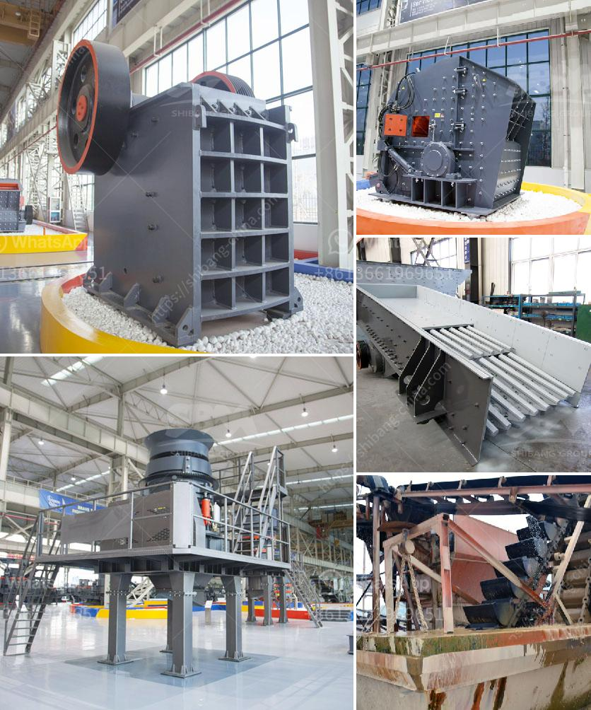

<h3>wet process of cement manufacture</h3>
The wet process of cement manufacturing refers to grinding raw material into slurry after mixing with water and then feeding them into the wet process kiln for drying and calcination and finally forming clinker. The slurry's water content is usually between 32%-36%.

During the wet process, water is used to cool the kiln system and the temperature rises as the water evaporates. The clinker is then ground with other mineral materials to form the cement and the remaining calcium carbonate is grounded to a fine powder to make cement.

The raw materials used in the manufacture of cement are limestone, clay, and iron ore. Limestone is the main component of cement, accounting for 60-70% of the total raw material composition required for making cement. Clay and iron ore are used as the auxiliary raw materials.

Raw materials are crushed, mixed with water to form a slurry, and blended to a fine powder. This blending is done by passing the finely crushed material into a long rotating drum called a slurry mill.

The slurry is formed by mixing the blended raw materials with water in a slurry mill. The slurry has a liquid content of 32-36% and is then stored in large tanks known as slurry tanks.

The slurry is preheated and precalcined in a preheater before entering the kiln. This process reduces the moisture content in the slurry, which is crucial for the efficient operation of the kiln.

The preheated slurry is fed into the kiln, where it is heated to a high temperature (up to 1500°C) and converted into clinker. This process is known as clinkering. The clinker is a small, irregular nodular material with a diameter of 3-25mm.

The clinker is cooled in a clinker cooler to a temperature suitable for conveying and storing. This cooling process is necessary to prevent the clinker from reacting with atmospheric moisture, which would result in the premature hardening of the cement.

The cooled clinker is reduced to a fine powder in a ball mill with the addition of gypsum to control the setting properties of the cement. The size of the ground particles is determined by the mesh size of the sieve used in the grinding process.

The ground cement is stored in silos before being packed in bags or bulk. It is then ready for transportation and use in various construction projects.

The wet process of cement manufacturing has been widely used in recent years because of its distinct advantages over the dry process. It relies on creating a slurry with a high moisture content before being fed into the kiln. This results in lower energy consumption during the burning process and also reduces dust emissions.

However, the wet process has some limitations. It requires more energy for drying the slurry, making it less energy-efficient compared to the dry process. The wet process also produces a larger quantity of waste heat, which needs to be properly managed.

In conclusion, the wet process of cement manufacturing involves the grinding of raw materials into a slurry with high moisture content, followed by the kiln burning process to create clinker. Despite some drawbacks, the wet process has been widely adopted due to its energy efficiency and reduced dust emissions.
<h3>Contact us</h3><ul><li><strong>Whatsapp:&nbsp;<a href="https://wa.me/8613661969651">+8613661969651</a></strong></li><li><a href="https://swt.shibang-china.com/?git&amp;zhl&amp;wet process of cement manufacture"><strong>Online Service(chat now)</strong></a></li></ul><h3>Related</h3><ul><li><a href='limestone crusher rotor mechanical.md'>limestone crusher rotor mechanical</a></li><li><a href='used crushing plants for sale in uae.md'>used crushing plants for sale in uae</a></li><li><a href='gypsum mining plant.md'>gypsum mining plant</a></li><li><a href='mtm 160 mill spare parts suppliers in india.md'>mtm 160 mill spare parts suppliers in india</a></li><li><a href='hammer mill in malaysia.md'>hammer mill in malaysia</a></li></ul>