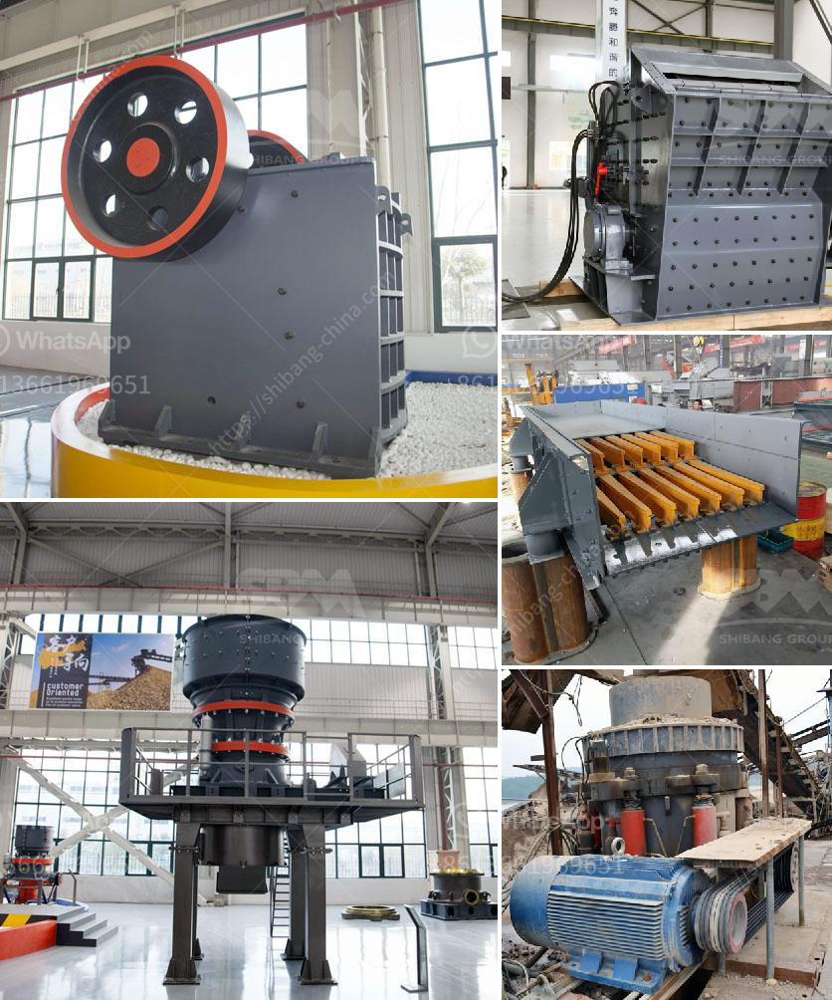

<h3>wet process of cement production</h3>
The wet process of cement production involves grinding raw materials such as limestone, clay, and silica into a fine powder. This mixture is then combined with water to form a slurry, which is fed into a cement kiln to be heated at temperatures of up to 1450 degrees Celsius. The resulting chemical reaction between the raw materials creates clinker, which is then ground into the fine powder known as cement.

The wet process has been used for centuries and is the traditional method of producing cement. It is more energy-intensive and requires a larger amount of water compared to the dry process, making it less environmentally friendly. However, the wet process offers several advantages.

Firstly, the wet process allows for a more thorough mixing of raw materials, resulting in a better-quality product. The slurry mixture ensures a homogenous blend of materials, leading to a higher strength and durability of the final cement.

Secondly, the wet process allows for better control over the size and shape of the cement particles. The grinding of the raw material produces a finer and more uniform powder, which contributes to improved workability and setting time of the cement.

Lastly, the wet process enables the use of a wider range of raw materials. This flexibility allows for the utilization of waste materials such as slag, fly ash, and industrial by-products, thereby reducing the environmental impact and cost of cement production.

Despite its advantages, the wet process also has its drawbacks. The high energy consumption and water usage, as well as the potential for air pollution during the production, are concerns that need to be addressed. As a result, the industry has been striving to develop more sustainable and environmentally friendly alternatives, such as the dry process.

In conclusion, the wet process of cement production has been a widely used and effective method for centuries. While it offers benefits such as higher quality, better control over particle size, and utilization of a wider range of raw materials, it is important for the industry to continue improving sustainability and reducing environmental impact in order to meet the demands of a more eco-conscious world.
<h3>Contact us</h3><ul><li><strong>Whatsapp:&nbsp;<a href="https://wa.me/8613661969651">+8613661969651</a></strong></li><li><a href="https://swt.shibang-china.com/?git&amp;zhl&amp;wet process of cement production"><strong>Online Service(chat now)</strong></a></li></ul><h3>Related</h3><ul><li><a href='slag cement manufacturing process youtube.md'>slag cement manufacturing process youtube</a></li><li><a href='petroleum coke mill.md'>petroleum coke mill</a></li><li><a href='small scale pulverizing ball mill.md'>small scale pulverizing ball mill</a></li><li><a href='crushing plant turkey.md'>crushing plant turkey</a></li><li><a href='used mining equipment for sale in ghana.md'>used mining equipment for sale in ghana</a></li></ul>