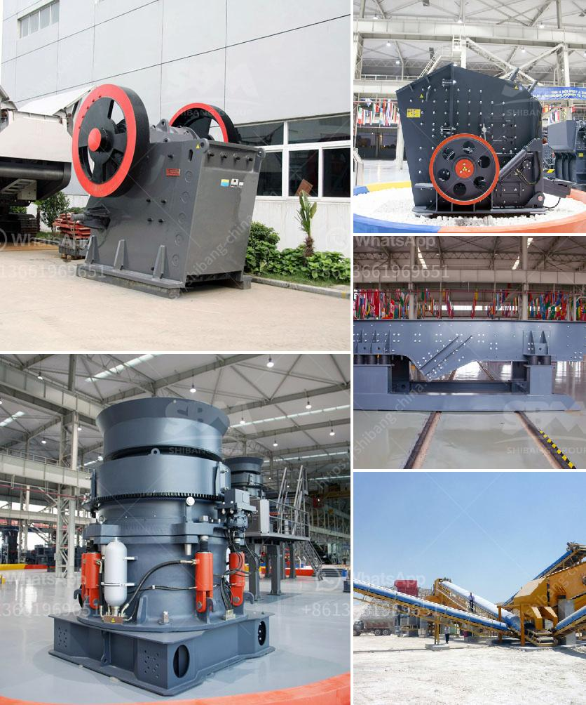

<h3>what is a mobile crusher</h3>
A mobile crusher is a machine designed to reduce large rocks into smaller rocks, gravel, or rock dust. Crushers may be used to reduce the size, or change the form, of waste materials so they can be more easily disposed of or recycled, or to reduce the size of a solid mix of raw materials (as in rock ore), so that pieces of different composition can be differentiated. Crushing is the process of transferring a force amplified by mechanical advantage through a material made of molecules that bond together more strongly, and resist deformation more, than those in the material being crushed do.

The earliest crushers were hand-held stones, where the weight of the stone provided a boost to muscle power, used against a stone anvil. Querns and mortars are types of these crushing devices. The global mobile crusher market is expected to witness high growth during the forecast period. The report provides key statistics on the market status of the leading players and offers key trends and opportunities in the mobile crusher market.

Some of the key players operating in the market include RUBBLE MASTER HMH GmbH, Sandvik AB, Terex Corporation, SBM Mineral processing GmbH, Kleemann GmbH, mpl Mineral processing GmbH, Striker Australia Pty Ltd, Shanghai mpl Machinery Co., Ltd., HARTL Engineering & Marketing GmbH., and IROCK Crushers.

Mobile crushers are widely used in the mining industry for processing quarried materials and heavy mining substances. With the additional advantage of transportation to the required location and maneuvering the equipment within the site, the mobile crushers demand is surging recently. Technological innovations in mobile crushers and rising investment in mining projects are expected to drive the market growth. The increased production capacity and less downtime are the advantages of mobile crushing plants.

The global mobile crusher market is projected to expand at a fairly CAGR during the forecast period. The market is expanding rapidly due to an increase in mining activities in the emerging economies and advancements in technology in the mobile crushers and screeners used for mining processes. Mobile crushers and screeners help convert large solid masses into smaller components so they can be handled easily or processed further for their value-add. The market is also driven by increasing infrastructural developments and increasing construction activities.

The rise in mobile crushers and screeners demand has been influenced mainly by the increasing construction activities and mining activities across the globe. The mining industry has been witnessing steady growth since the past few years, owing to the rise in mining exploration activities and initiation of new mining projects in countries, such as Canada, Australia, and Brazil. The influx of mining activities in APAC region has also led to the rise in demand for the mining equipment such as mobile crushers and screeners, thereby boosting the market.

Moreover, the infrastructure development across the globe is driving the market for mobile crushers and screeners. Additionally, it is estimated that the global mobile crushers and screeners market is likely to witness a significant growth during the forecast period from 2019 to 2027. This growth can be attributed to the increasing mineral processing activities, prevalence of hazardous work locations, as well as the rising number of mining exploration activities across the globe. The increase in urbanization and industrialization activities, coupled with the rise in population, are also driving the global mobile crushers and screeners market.
<h3>Contact us</h3><ul><li><strong>Whatsapp:&nbsp;<a href="https://wa.me/8613661969651">+8613661969651</a></strong></li><li><a href="https://swt.shibang-china.com/?git&amp;zhl&amp;what is a mobile crusher"><strong>Online Service(chat now)</strong></a></li></ul><h3>Related</h3><ul><li><a href='pulverizer for calcium carbonate.md'>pulverizer for calcium carbonate</a></li><li><a href='marble and granite plant.md'>marble and granite plant</a></li><li><a href='what is the hammer mill.md'>what is the hammer mill</a></li><li><a href='ball mill for 15tphr capacity.md'>ball mill for 15tphr capacity</a></li><li><a href='ultrafine mill in china.md'>ultrafine mill in china</a></li></ul>