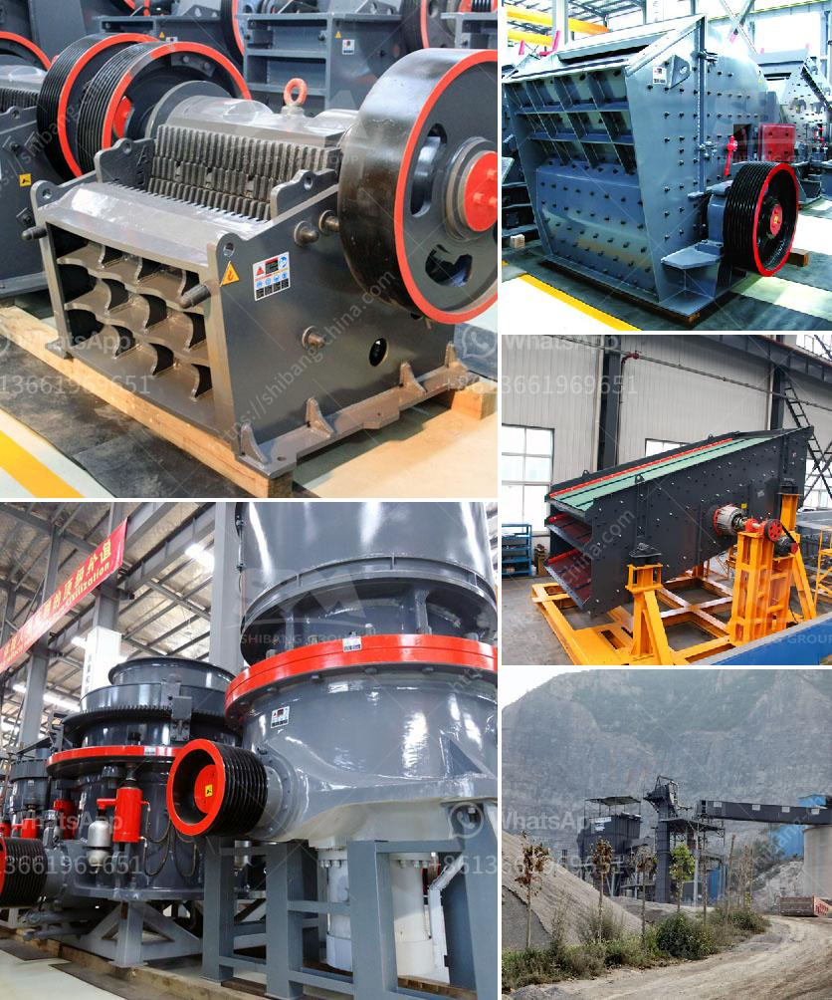

<h3>what is cost for 50 tpd cement plant</h3>
The cost of a 50 TPD (tons per day) cement plant depends on a variety of factors. These factors may include the size of the plant, the technology used, the location of the plant, and the cost of land, labor, cement, machinery, and equipment. In this article, we will discuss these factors and estimate the potential cost of setting up such a plant.

Firstly, the size of the cement plant plays a crucial role in determining its cost. A 50 TPD cement plant is relatively small compared to larger plants that can have thousands of tons of production capacity. Smaller plants tend to have lower costs, as they require less land, labor, and machinery. Additionally, smaller plants can be located in areas with lower land prices, reducing the overall cost of the project.

Secondly, the technology used in the cement plant also influences the cost. Different technologies have varying levels of efficiency and require different levels of investment. For example, the cost of a traditional wet process cement plant may differ from a more modern dry process plant. The choice of technology depends on factors such as the availability and cost of fuel, local environmental regulations, and the desired output quality.

Moreover, the location of the plant has a significant impact on the cost. The cost of land can vary significantly from region to region, and land prices in urban areas or prime industrial locations tend to be higher. Additionally, the proximity to raw materials, such as limestone and clay, can affect transportation costs. Access to infrastructure, such as roads, railways, and ports, can also impact the cost of the plant.

Furthermore, labor costs play a significant role in determining the overall project cost. Labor costs can differ across countries and regions due to variations in wages, productivity levels, and labor regulations. Setting up a plant in a country with lower labor costs can result in substantial savings.

Additionally, the cost of cement, machinery, and equipment must be considered. The prices of these items can vary depending on the suppliers, market conditions, and currency fluctuations. It is essential to research and compare prices to obtain the best deal.

Based on these factors, it is difficult to provide an accurate estimate of the cost of a 50 TPD cement plant. However, considering the lower capacity and potential economies of scale, a rough estimate can be made. A 50 TPD cement plant might cost around $2-3 million, excluding land and infrastructure costs. This estimate is approximate and can vary depending on the factors mentioned earlier.

In conclusion, the cost of setting up a 50 TPD cement plant depends on various factors, including plant size, technology, location, labor costs, and prices of cement, machinery, and equipment. It is essential to conduct thorough research, obtain quotes from suppliers, and consider all these factors to get an accurate estimate.
<h3>Contact us</h3><ul><li><strong>Whatsapp:&nbsp;<a href="https://wa.me/8613661969651">+8613661969651</a></strong></li><li><a href="https://swt.shibang-china.com/?git&amp;zhl&amp;what is cost for 50 tpd cement plant"><strong>Online Service(chat now)</strong></a></li></ul><h3>Related</h3><ul><li><a href='marble granite stone grinding machine price.md'>marble granite stone grinding machine price</a></li><li><a href='aggregates crushing plant assembly in china.md'>aggregates crushing plant assembly in china</a></li><li><a href='sand manufacturing small scale.md'>sand manufacturing small scale</a></li><li><a href='aggregate screening plants.md'>aggregate screening plants</a></li><li><a href='used rock fine crusher for sale.md'>used rock fine crusher for sale</a></li></ul>