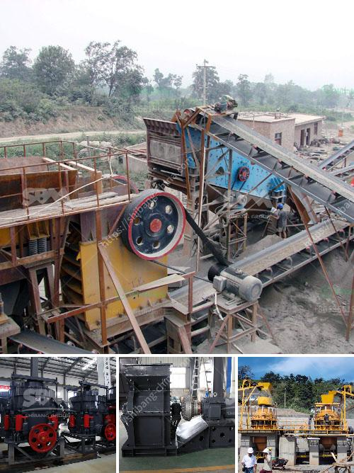

<h3>what is the dam ring in vertical rollers mill</h3>
The dam ring is an important component of the vertical roller mill. It ensures that the material is ground to the required fineness efficiently and accurately. The dam ring allows for the material to be brought out of the grinding chamber and into the separator at a consistent level.

In a vertical roller mill, the grinding table rotates horizontally and the rollers move vertically. The material is fed towards the center of the grinding table, where it is ground between the rollers and the grinding table. The ground material is then transported upwards to the separator, where it is separated into fine and coarse particles.

The dam ring is located at the outer diameter of the grinding table and acts as a barrier between the grinding chamber and the rest of the mill. Its primary purpose is to prevent the material from flowing back into the grinding chamber, ensuring a steady flow of material through the separator.

The dam ring is adjustable, allowing for fine-tuning of the grinding process. By adjusting the dam ring, the operator can control the material flow and the fineness of the finished product. This is important in achieving the desired product quality and optimizing the overall mill performance.

Moreover, the dam ring also helps in creating a pressure zone under the grinding rollers. This pressure zone enhances the grinding efficiency by stabilizing the bed of material on the grinding table. It prevents excessive vibrations and ensures a smooth operation of the mill.

In conclusion, the dam ring is a crucial component in the vertical roller mill. It plays a key role in ensuring the efficient grinding of material and the production of a high-quality finished product. Its adjustable nature allows for fine-tuning and optimization of the grinding process, resulting in improved mill performance.
<h3>Contact us</h3><ul><li><strong>Whatsapp:&nbsp;<a href="https://wa.me/8613661969651">+8613661969651</a></strong></li><li><a href="https://swt.shibang-china.com/?git&amp;zhl&amp;what is the dam ring in vertical rollers mill"><strong>Online Service(chat now)</strong></a></li></ul><h3>Related</h3><ul><li><a href='grinding mill machine for sale.md'>grinding mill machine for sale</a></li><li><a href='250 tons per hour crushers.md'>250 tons per hour crushers</a></li><li><a href='machine to crush quartz into powder.md'>machine to crush quartz into powder</a></li><li><a href='rock processing plant.md'>rock processing plant</a></li><li><a href='cara menghitung kapasitas pada belt conveyor.md'>cara menghitung kapasitas pada belt conveyor</a></li></ul>