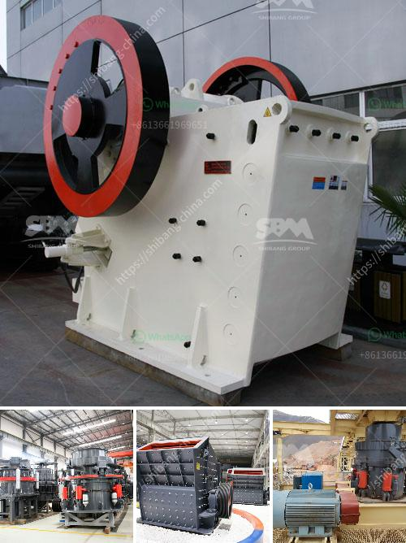

<h3>what is the feed of jaw crusher</h3>
The jaw crusher is one of the most commonly used primary crushers in the mining, quarrying, and construction industries. It is designed to crush large rocks into smaller particles for further processing in the secondary and tertiary crushing stages.

The feed of the jaw crusher plays a crucial role in its operation and efficiency. Generally, the maximum size of the raw material should not exceed 80% of the gape distance or 85% of the width of the inlet opening. Therefore, it is essential to properly size the feed to ensure optimum performance of the crusher.

An oversized feed can cause the crusher to choke and become less efficient, leading to excessive wear and possible damage to components. On the other hand, an undersized feed may result in poor crushing efficiency and reduced throughput capacity. Additionally, it may lead to uneven wear distribution on the jaw plates, affecting their longevity.

To determine the appropriate feed size for a jaw crusher, several factors should be considered. These include the maximum feed size requirements of downstream equipment, the desired product size, and the properties of the material being crushed. Additionally, the capacity of the crusher and the required power input should also be taken into account.

It is recommended to conduct a thorough analysis of the feed material to understand its characteristics, such as hardness, abrasiveness, and moisture content. This information can help determine the appropriate jaw crusher model and settings, such as the CSS (closed side setting), which refers to the smallest gap between the jaw plates at the bottom of the crushing chamber.

Properly sizing the feed for a jaw crusher can optimize its performance and prolong its lifespan. It is advisable to consult with experts or manufacturers to ensure that the crusher is being operated with an appropriate feed size. By doing so, operators can achieve efficient crushing, reduce downtime, and maximize the productivity of their jaw crusher.
<h3>Contact us</h3><ul><li><strong>Whatsapp:&nbsp;<a href="https://wa.me/8613661969651">+8613661969651</a></strong></li><li><a href="https://swt.shibang-china.com/?git&amp;zhl&amp;what is the feed of jaw crusher"><strong>Online Service(chat now)</strong></a></li></ul><h3>Related</h3><ul><li><a href='pictures of copper ore mining nigeria.md'>pictures of copper ore mining nigeria</a></li><li><a href='calcium carbonate grinding mill price.md'>calcium carbonate grinding mill price</a></li><li><a href='horizontal grinding mills price.md'>horizontal grinding mills price</a></li><li><a href='stone crusher plant machinery.md'>stone crusher plant machinery</a></li><li><a href='usa vertical roller mill.md'>usa vertical roller mill</a></li></ul>