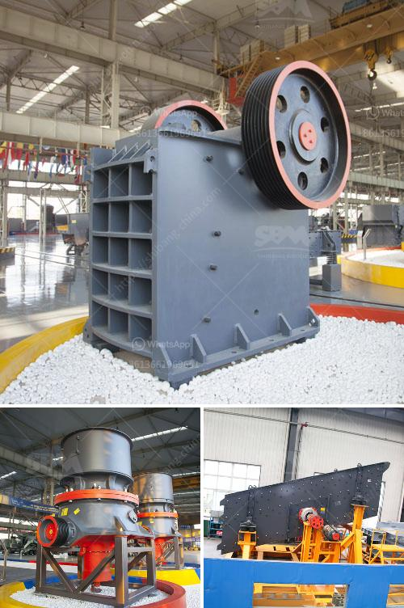

<h3>what is the hammer mill</h3>
When it comes to industrial machinery, particularly for the agricultural industry, hammer mills are among the most important pieces. Though they may seem like simple devices, the hammer mills play a crucial role in many industries, particularly that of agriculture.

A hammer mill is a machine that is used to shred or crush materials into smaller pieces. It consists of a large, rotating hammer, which is driven by a motor. It uses shear force to break and reduce the size of various materials.

The hammer mill has a hinged door, which provides easy access to the mill's interior. It also has the ability to change the screen size, creating different particle sizes to meet specific requirements.

These machines are used in a variety of industries. The most common industries that utilize hammer mills include the agricultural, chemical, and pharmaceutical sectors. However, they are also used in waste management, recycling, and many other industries.

In the agricultural industry, hammer mills are commonly used to pulverize or crush grains, soybeans, corn, and other crops into smaller particles. This makes it easier for farmers to feed their livestock, as well as for the production of animal feed.

In the chemical and pharmaceutical industries, hammer mills are utilized to reduce particle size for processes such as granulation, mixing, drying, and coating. These industries often require precise particle size distribution for their products, and hammer mills provide an efficient and cost-effective solution.

Hammer mills are an essential tool in the waste management and recycling industries. They are used to shred paper, cardboard, plastic, and other materials to create a more compact and uniform product for easier recycling and disposal. Additionally, hammer mills can be used to process waste biomass materials, such as wood chips, bark, and straw, into fuel for heating or power generation.

The hammer mill's versatility and ease of use make it the ideal choice for processing a wide variety of materials in different industries. However, not all hammer mills are created equal. It is essential to choose the right machine for the specific application to ensure optimal performance and efficiency.

Factors to consider when selecting a hammer mill include the desired particle size, the hardness of the material being processed, the required capacity, and the power source available. Different hammer mill models have varying features and capabilities, so it is crucial to consult with an expert or supplier to find the right fit for your needs.

In conclusion, a hammer mill is a crucial piece of equipment in the agricultural, chemical, and pharmaceutical industries. It is used to crush and shred a wide range of materials, making it essential for various processes. When selecting a hammer mill, it is important to consider factors such as particle size, material hardness, capacity, and power source.
<h3>Contact us</h3><ul><li><strong>Whatsapp:&nbsp;<a href="https://wa.me/8613661969651">+8613661969651</a></strong></li><li><a href="https://swt.shibang-china.com/?git&amp;zhl&amp;what is the hammer mill"><strong>Online Service(chat now)</strong></a></li></ul><h3>Related</h3><ul><li><a href='business plan for quarry.md'>business plan for quarry</a></li><li><a href='200 tph mobile crushing plant.md'>200 tph mobile crushing plant</a></li><li><a href='marble and granite plant.md'>marble and granite plant</a></li><li><a href='portable ballast crusher.md'>portable ballast crusher</a></li><li><a href='used clay grinding machine for sale.md'>used clay grinding machine for sale</a></li></ul>