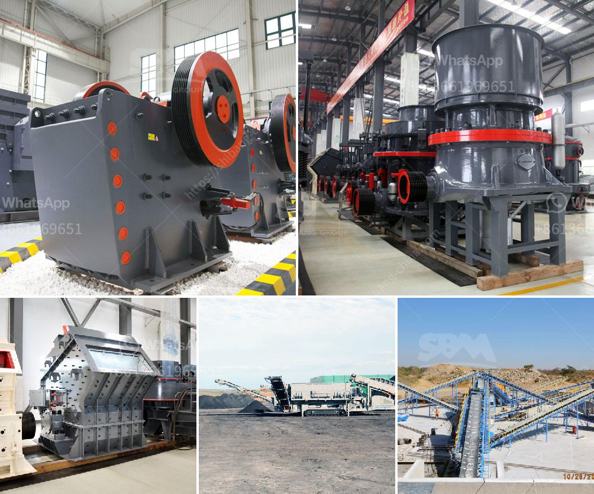

<h3>which roller stand in milling industry</h3>
When it comes to the milling industry, having a reliable roller stand is crucial for ensuring smooth operations and optimal efficiency. Roller stands are used to support materials during the milling process, providing stability and enabling precise cutting and shaping. However, with numerous options available in the market, it can be challenging to determine which roller stand is best suited for the milling industry's specific needs.

One standout roller stand that has gained significant recognition in the milling industry is the XYZ roller stand. This innovative piece of equipment offers exceptional stability and durability, making it a top choice amongst milling professionals. The XYZ roller stand features a heavy-duty construction with high-quality materials, ensuring it can withstand the rigors of continuous milling operations.

One of the standout features of the XYZ roller stand is its adjustable height mechanism. This allows milling professionals to set the stand at an ideal height, ensuring optimal support for various materials and workpieces. Whether dealing with large or small-sized materials, the XYZ roller stand can provide the necessary stability and support, ultimately enhancing the overall milling experience.

Another key aspect that sets XYZ roller stand apart from its competitors is its ease of use. The stand incorporates user-friendly features like quick-release mechanisms, allowing for effortless adjustments and smooth transitions. This saves valuable time in the milling process and enhances productivity.

Additionally, the XYZ roller stand is designed with safety in mind. It includes advanced safety features such as non-slip pads and secure locking mechanisms, preventing any accidental slips or movements during milling operations. This prioritization of safety makes the XYZ roller stand an excellent choice for milling professionals who value the wellbeing of their workers.

In conclusion, within the milling industry, having a reliable roller stand is essential for smooth operations and enhanced productivity. The XYZ roller stand stands out as a top choice due to its exceptional stability, durability, adjustability, ease of use, and prioritization of safety. With this roller stand, milling professionals can be confident in their ability to handle materials efficiently and effectively, ultimately leading to optimal milling outcomes.
<h3>Contact us</h3><ul><li><strong>Whatsapp:&nbsp;<a href="https://wa.me/8613661969651">+8613661969651</a></strong></li><li><a href="https://swt.shibang-china.com/?git&amp;zhl&amp;which roller stand in milling industry"><strong>Online Service(chat now)</strong></a></li></ul><h3>Related</h3><ul><li><a href='stamp mill for sale in south africa.md'>stamp mill for sale in south africa</a></li><li><a href='talc mineral processing.md'>talc mineral processing</a></li><li><a href='manufactured sand screening machine.md'>manufactured sand screening machine</a></li><li><a href='crusher santa marta malaysia.md'>crusher santa marta malaysia</a></li><li><a href='grinder for milling price in india.md'>grinder for milling price in india</a></li></ul>