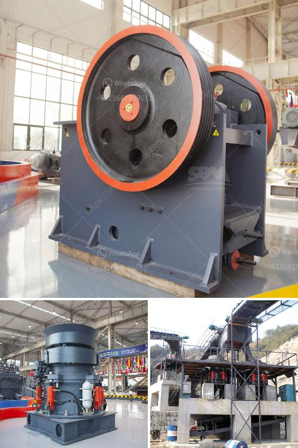

<h3>which way should the ball mill rotate</h3>
The ball mill is a key piece of equipment in grinding operations, and it is widely used in industries such as mining, cement, ceramics, and more. Knowing the right direction for the ball mill to rotate is crucial for achieving efficient grinding results.

To understand which way the ball mill rotates, it is important to look at the mill's drum from its end. This orientation will help determine the actual motion of the grinding media and the material being ground.

In most cases, ball mills have a rotational direction of counterclockwise, meaning that the drum spins as the grinding media and the material inside it rotate against the walls of the drum. This counterclockwise motion is the most common direction for the mill to rotate, as it ensures optimal grinding efficiency and helps to prevent excessive wear on the drum and the grinding media.

However, there are exceptions to this general rule. In some cases, ball mills can also rotate in a clockwise direction. This is typically seen in applications where specific grinding conditions or material properties require a reverse motion. For instance, materials that are prone to agglomeration or sticking to the drum's walls may benefit from a clockwise rotation to help dislodge and break up such build-ups.

Besides the considerations of grinding efficiency and material characteristics, the direction of ball mill rotation may also depend on the layout and design of the mill itself. Factors such as the arrangement of the grinding media, the shape of the drum, and the location of the feed and discharge points can all influence the preferred rotational direction for optimal performance.

In addition to the direction of rotation, other operating parameters, such as drum speed, ball size, and filling ratio, also play important roles in determining the milling efficiency and the final particle size distribution. Therefore, it is crucial to consider these factors in conjunction with the rotational direction for successful grinding operations.

To sum up, the directional rotation of a ball mill depends on various factors, including the desired grinding efficiency, material properties, and mill design. In most cases, ball mills rotate counterclockwise to achieve optimal grinding results. However, there are exceptions where a clockwise rotation may be necessary. Ultimately, it is essential to analyze the specific requirements of each application to determine the best rotational direction for the ball mill. A thorough understanding of the process and expert guidance can help ensure the right direction, leading to improved grinding performance and optimal productivity.
<h3>Contact us</h3><ul><li><strong>Whatsapp:&nbsp;<a href="https://wa.me/8613661969651">+8613661969651</a></strong></li><li><a href="https://swt.shibang-china.com/?git&amp;zhl&amp;which way should the ball mill rotate"><strong>Online Service(chat now)</strong></a></li></ul><h3>Related</h3><ul><li><a href='small scale hard rock gold ore processing.md'>small scale hard rock gold ore processing</a></li><li><a href='ethiopia unused cone crusher for sale.md'>ethiopia unused cone crusher for sale</a></li><li><a href='cost on vsi crusher.md'>cost on vsi crusher</a></li><li><a href='manufacturers of conveyor belts.md'>manufacturers of conveyor belts</a></li><li><a href='sample business plan for stone crusher in bolivia.md'>sample business plan for stone crusher in bolivia</a></li></ul>