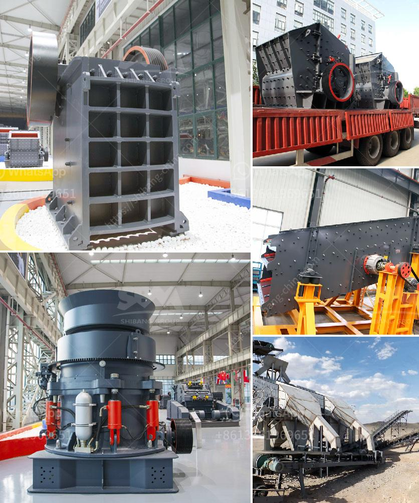

<h3>white clay crusher process</h3>
White clay, also known as kaolin clay, is a popular material used in ceramics, paper making, paint, cosmetics, and various other industries. It is prized for its unique properties, including its ability to absorb excess oil, improve skin texture, and enhance the performance of products.

The process of crushing white clay involves several steps, ensuring the raw material is effectively utilized for different products. The clay undergoes a primary crushing stage, where large pieces are reduced to smaller sizes suitable for further processing. This is typically achieved using a jaw crusher or impact crusher, which breaks down the clay into more manageable chunks.

After the initial crushing, the clay is further ground into a finer powder using various grinding mills. These mills can include ball mills, hammer mills, or vertical roller mills, depending on the desired particle size. The grinding process helps to eliminate impurities, improve the clay's plasticity, and enhance its overall performance.

Once the clay is finely ground, it can be used in a wide range of applications. In ceramics, the clay is mixed with water and other additives to form a moldable paste that is shaped and fired to create pottery, tiles, and other ceramic products. In the paper industry, it is used as a filler and coating agent to improve whiteness, smoothness, and printability.

The cosmetic industry also employs white clay in the production of skincare and hair care products. Its absorbent properties make it an ideal ingredient in face masks, cleansers, and dry shampoos, helping to remove impurities and excess oil from the skin and scalp.

In conclusion, the white clay crusher process plays a crucial role in transforming raw clay into a versatile material for various industries. From crushing to grinding, this process ensures that the clay is appropriately sized and refined for its intended use. With its unique properties and wide range of applications, white clay continues to be a valuable resource in the manufacturing world.
<h3>Contact us</h3><ul><li><strong>Whatsapp:&nbsp;<a href="https://wa.me/8613661969651">+8613661969651</a></strong></li><li><a href="https://swt.shibang-china.com/?git&amp;zhl&amp;white clay crusher process"><strong>Online Service(chat now)</strong></a></li></ul><h3>Related</h3><ul><li><a href='belt conveyor indonesia.md'>belt conveyor indonesia</a></li><li><a href='quotations for stone crushers.md'>quotations for stone crushers</a></li><li><a href='hammer mill in malaysia.md'>hammer mill in malaysia</a></li><li><a href='rock crusher production line.md'>rock crusher production line</a></li><li><a href='raymond grinder mill pakistan.md'>raymond grinder mill pakistan</a></li></ul>