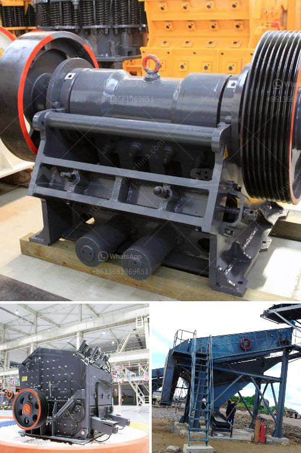

<h3>working principle of conveyor belt</h3>
The conveyor belt has been an essential part of material transportation for many years. It is used in industries ranging from mining to construction, food processing to pharmaceuticals, and many more. The principle of a conveyor belt is simple, yet it is important to understand how this amazing machinery works.

A conveyor belt system consists of two or more pulleys, with an endless loop of belt that rotates around them. The conveyor belt is powered by a motor, and it moves materials from one location to another by rotating and transferring the motion generated.

The basic working principle of a conveyor belt is the movement of materials along the belt. As materials are added to the belt from the feeding end, they are propelled by the rotating motion of the belt towards the discharge end. The speed and direction of the belt’s rotation determine the movement of the materials.

The conveyor belt is made up of multiple layers of material. The top layer, known as the cover, is resistant to wear and tear and provides the necessary protection for the inner layers. The carcass, which consists of multiple plies of fabric or steel cords, forms the core strength of the belt. The bottom layer, known as the bottom cover, provides additional protection to the carcass.

The conveyor belt is driven by a motor, which generates the required rotational motion. The motor is connected to the pulleys, which are responsible for the movement of the belt. The driving pulley is usually larger in size compared to the tail pulley because it needs to generate more force to move the belt. The tension in the belt can be adjusted by changing the position of the tail pulley or by adding a tensioning device.

Conveyor belts can be categorised into two types based on their working principle: flat belts and trough belts.

Flat Belt Conveyor: A flat belt conveyor is the most common type of conveyor belt. It uses a flat belt with a series of pulleys and idlers along its path. The belt is supported by rotating idler rolls located beneath it. As the belt moves, the idler rolls rotate, creating a continuous loop of moving material.

Trough Belt Conveyor: A trough belt conveyor is designed with curved sides to form a trough shape. This allows for the materials to be contained within the belt, preventing spillage. The belt rests on a series of idler rolls that support the weight of the material and allow it to flow smoothly along the belt.

In conclusion, the working principle of a conveyor belt involves the continuous movement of materials along the belt through the rotation of pulleys and the use of motor power. The conveyor belt is essential for efficient and safe transportation of goods in industries ranging from mining to food processing. Understanding the principles behind how conveyor belts work can help in optimizing their performance and improving overall productivity.
<h3>Contact us</h3><ul><li><strong>Whatsapp:&nbsp;<a href="https://wa.me/8613661969651">+8613661969651</a></strong></li><li><a href="https://swt.shibang-china.com/?git&amp;zhl&amp;working principle of conveyor belt"><strong>Online Service(chat now)</strong></a></li></ul><h3>Related</h3><ul><li><a href='almond sand stone crusher price.md'>almond sand stone crusher price</a></li><li><a href='cement mill operation manual.md'>cement mill operation manual</a></li><li><a href='small scale hard rock gold ore processing.md'>small scale hard rock gold ore processing</a></li><li><a href='raymond grinder mill pakistan.md'>raymond grinder mill pakistan</a></li><li><a href='buy nigeria stone crusher.md'>buy nigeria stone crusher</a></li></ul>