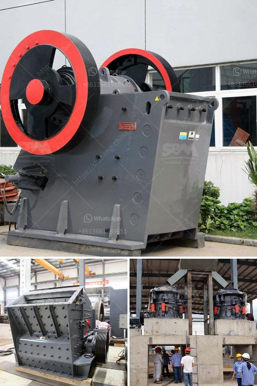

<h3>working scale model stone crusher</h3>
A working scale model stone crusher is an incredible tool for the construction industry as it will help professionals and hobbyists alike tackle difficult challenges with ease. The miniaturized version of the machine can process countless stones and rocks into a variety of different aggregates, making the process both efficient and affordable.

One of the main advantages of this working scale model is its portability. Unlike its full-sized counterparts, the mini version can easily be transported from one location to another without requiring specialized equipment. This means that construction crews can take advantage of its capabilities on different job sites, maximizing its usage.

The functionality of the working scale model stone crusher is impressive. It crushes stones into different sizes and types, which can then be used for various purposes such as pavement, building materials, and landscaping. The machine uses hydraulic and mechanical power to achieve this, ensuring that the process is efficient and reliable.

The stones are fed into the crusher through a vibrating feeder, where they are initially broken down into smaller pieces. From there, they pass through a series of crushing chambers, with hammers or blades that further break them down into the desired size. The crushed stones are then discharged onto a conveyor belt for easy collection and transport.

With its ability to process various types of rocks and stones, the working scale model stone crusher can be used in a wide range of applications. For example, it can be used to prepare aggregate for road construction projects, as well as for foundation work in buildings and landscaping projects. Its versatility makes it a valuable asset in any construction project.

Furthermore, the working scale model stone crusher is cost-effective and environmentally friendly. Its compact size and low energy consumption make it an economical option for small to medium-scale projects. In addition, it produces minimal noise and dust, ensuring a comfortable working environment for operators and nearby residents.

The working scale model stone crusher has become an essential tool for many construction professionals. Its ability to crush stones into various sizes and types makes it a valuable asset for any construction project. With its portability, functionality, and cost-effectiveness, it is an ideal solution for both professionals and hobbyists alike.

In conclusion, the working scale model stone crusher is a powerful and efficient tool for the construction industry. Its ability to process different types of stones into the desired size and type makes it invaluable for a wide range of applications. With its portability and cost-effectiveness, it is an indispensable asset for any construction project, big or small. Whether used in road construction, building foundations, or landscaping projects, this working scale model stone crusher is a game-changer in the industry.
<h3>Contact us</h3><ul><li><strong>Whatsapp:&nbsp;<a href="https://wa.me/8613661969651">+8613661969651</a></strong></li><li><a href="https://swt.shibang-china.com/?git&amp;zhl&amp;working scale model stone crusher"><strong>Online Service(chat now)</strong></a></li></ul><h3>Related</h3><ul><li><a href='crusher plant cost estimation.md'>crusher plant cost estimation</a></li><li><a href='gypsum board making machine price in india.md'>gypsum board making machine price in india</a></li><li><a href='rock crusher production line.md'>rock crusher production line</a></li><li><a href='quote for vsi crusher.md'>quote for vsi crusher</a></li><li><a href='what is a mobile crusher.md'>what is a mobile crusher</a></li></ul>