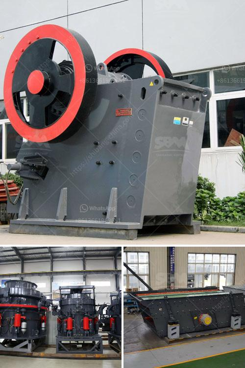

<h3>zimbabwe mobile crusher rentals</h3>
Mining operations in Zimbabwe have been steadily increasing over the years, contributing significantly to the country's economy. With the growth in the mining industry, there is a need for advanced machinery to ensure efficient extraction of minerals. Mobile crushers have emerged as an innovative solution for mining operations, offering convenience, accessibility, and versatility in crushing and screening processes.

Mobile crushers are essentially heavy-duty machinery mounted on wheeled or tracked chassis, capable of crushing various types of rocks and minerals. These crushers are designed to be easily transported from one site to another, making them ideal for mining operations in Zimbabwe, where locations are often remote and inaccessible. By allowing the crushing process to take place on-site, mobile crushers eliminate the need for transporting material to a centralized plant, saving time and reducing transportation costs.

One of the key advantages of mobile crushers is their ability to handle different types of materials. Whether it is hard rock, ore, or construction debris, mobile crushers can crush and process various materials effectively. This versatility is particularly beneficial for mining operations in Zimbabwe, which often require the extraction of different minerals from multiple sites. With mobile crushers, operators can easily move from one site to another, adapting to the changing requirements of their mining operations.

Another significant advantage of mobile crushers is their high production capacity. These crushers are designed to handle large amounts of material quickly and efficiently. With their powerful engines and robust construction, mobile crushers can process tons of material per hour, drastically increasing the productivity of mining operations. This increased production capacity translates into higher revenue and faster return on investment for mining companies in Zimbabwe.

The availability of mobile crusher rentals in Zimbabwe has further improved the viability of mobile crushers for mining operations. Renting mobile crushers allows mining companies to avoid the upfront capital investment and ongoing maintenance costs associated with purchasing their own crushers. Instead, they can simply rent a crusher whenever needed, paying only for the time it is in use. This flexibility allows mining operations to scale up or down their crushing operations based on demand, optimizing their resources and costs.

In addition to its economic benefits, mobile crusher rentals also offer sustainability advantages. By bringing the crushing process to the mining site, mobile crushers reduce the need for long-distance transportation, minimizing fuel consumption and carbon emissions. Furthermore, mobile crushers are designed to be energy-efficient, reducing the overall energy consumption of mining operations.

In conclusion, mobile crusher rentals have emerged as an innovative solution for mining operations in Zimbabwe. These crushers offer convenience, accessibility, and versatility in the crushing and screening processes, enabling mining companies to extract minerals efficiently. The availability of mobile crusher rentals allows mining operations to avoid capital investments and scale their crushing operations based on demand. Moreover, mobile crushers offer sustainability advantages by reducing the need for long-distance transportation and being energy-efficient. As the mining industry in Zimbabwe continues to grow, mobile crusher rentals are expected to play a vital role in supporting the sector's development.
<h3>Contact us</h3><ul><li><strong>Whatsapp:&nbsp;<a href="https://wa.me/8613661969651">+8613661969651</a></strong></li><li><a href="https://swt.shibang-china.com/?git&amp;zhl&amp;zimbabwe mobile crusher rentals"><strong>Online Service(chat now)</strong></a></li></ul><h3>Related</h3><ul><li><a href='hard stone aggregate crusher price.md'>hard stone aggregate crusher price</a></li><li><a href='used conical crushers for sale.md'>used conical crushers for sale</a></li><li><a href='industrial impact crushers.md'>industrial impact crushers</a></li><li><a href='wet grinding mill.md'>wet grinding mill</a></li><li><a href='mica powder machine.md'>mica powder machine</a></li></ul>