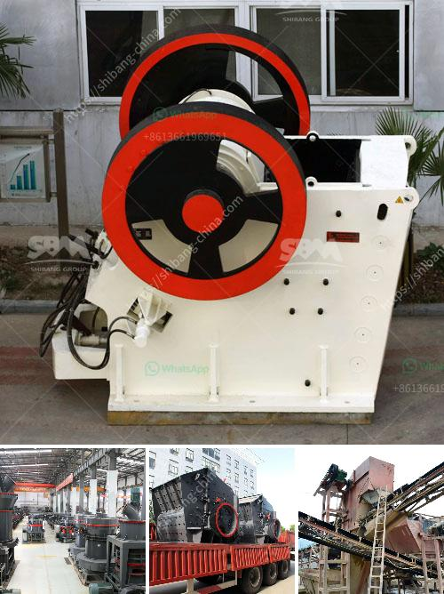

<h3>zircon sand production line price</h3>
Zircon sand is a valuable material used for a wide range of applications in various industries. It is known for its high refractive index, excellent heat resistance, and chemical stability. Due to these unique properties, zircon sand is highly sought after, resulting in a thriving zircon sand production line market.

The price of zircon sand production line varies depending on several factors. These factors include the capacity of the production line, the quality of the equipment, and the level of automation. Additionally, the location and availability of raw materials can also impact the price. However, it is important to note that investing in a high-quality production line is crucial to ensure efficient and cost-effective production of zircon sand.

One of the primary components of zircon sand production line is the crusher. The crusher is responsible for breaking the large chunks of zircon sand into smaller, more manageable sizes. The price of the crusher varies depending on its capacity and features. It is advisable to choose a crusher that can handle the desired production capacity with minimal downtime and maintenance.

Another critical component of the zircon sand production line is the screening equipment. The screening equipment is responsible for separating the desired size of zircon sand from other materials. It is essential to invest in reliable and efficient screening equipment to maximize productivity and minimize wastage. The price of the screening equipment depends on factors such as the size of the production line and the required level of precision in the separation process.

Additionally, the zircon sand production line may also include other equipment such as magnetic separators, gravity separators, and drying equipment. The price of these additional equipment depends on their capacity and features. Magnetic separators are used to remove magnetic impurities from the zircon sand, ensuring its purity. Gravity separators are employed to separate zircon sand from lighter impurities based on their different densities. Drying equipment is used to remove moisture from the zircon sand, preparing it for further processing or packaging.

Automation plays a significant role in determining the price of the zircon sand production line. A fully automated production line is more expensive compared to a semi-automated or manual one. However, investing in automation can result in higher productivity, lower labor costs, and improved product quality. It is crucial to assess the needs and resources of the production facility to determine the level of automation that is feasible and cost-effective.

The location and availability of raw materials can also impact the price of the zircon sand production line. Zircon sand is primarily obtained from beach sands or placer deposits. The transportation costs associated with sourcing raw materials from distant locations can increase the overall production line price. Therefore, it is advisable to choose a production line location near an abundant and consistent source of zircon sand.

In conclusion, the price of a zircon sand production line depends on several factors such as the capacity of the production line, the quality of the equipment, the level of automation, and the location and availability of raw materials. Investing in a high-quality production line is crucial to ensure efficient and cost-effective production of zircon sand. By considering these factors, businesses can make informed decisions and optimize their zircon sand production processes.
<h3>Contact us</h3><ul><li><strong>Whatsapp:&nbsp;<a href="https://wa.me/8613661969651">+8613661969651</a></strong></li><li><a href="https://swt.shibang-china.com/?git&amp;zhl&amp;zircon sand production line price"><strong>Online Service(chat now)</strong></a></li></ul><h3>Related</h3><ul><li><a href='stone crushing machine prices za.md'>stone crushing machine prices za</a></li><li><a href='trommel ball mill.md'>trommel ball mill</a></li><li><a href='manganese mobile processing plants.md'>manganese mobile processing plants</a></li><li><a href='cobalt mobile crushing plant.md'>cobalt mobile crushing plant</a></li><li><a href='rock quarry equipment.md'>rock quarry equipment</a></li></ul>